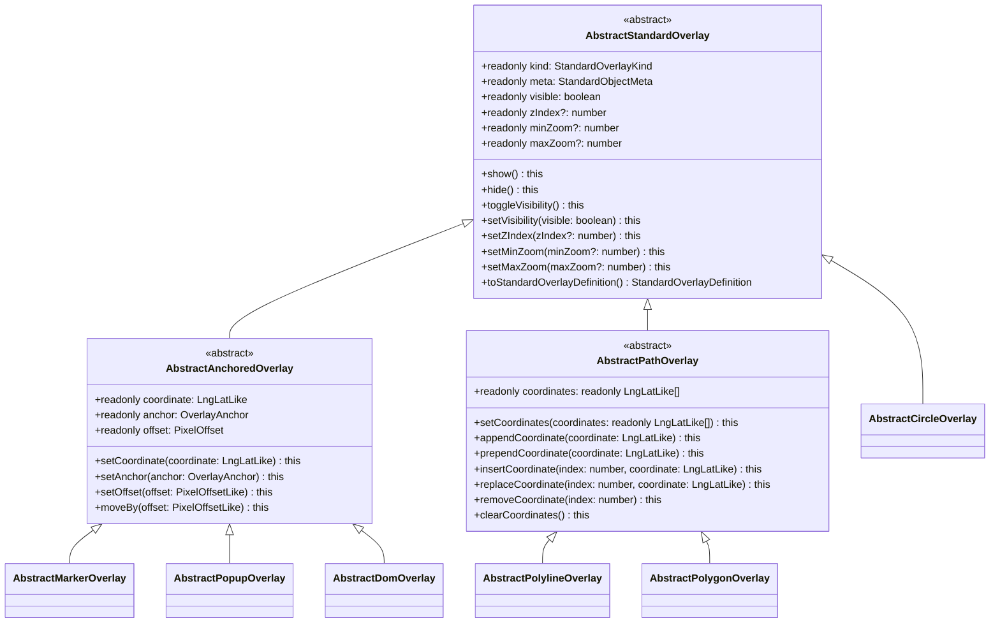
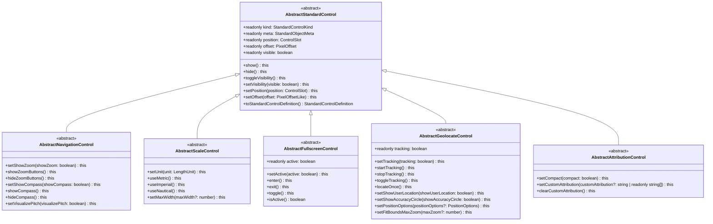

# 统一 Overlay / Control 标准对象层方案

这份文档是定稿方案，不再保留“可选路线”。

最终结论只有一句话：

> 丰富的 `Overlay / Control` 公共 API 不应继续塞进 `core/`，而应单独放进一个 `standard/` 标准对象层；`core/` 只保留最小协议；标准对象的公开 API 全部固化在 `standard/`；adapter 继续作为统一描述到 SDK 的翻译中心；若某个引擎需要 provider helper 类，也只能复用这些 `standard` 抽象并保持 adapter 内部可见。

这样做的目的很明确：

- 不污染最小内核
- 不让 adapter 发明公开 API
- 让各 provider 共享同一套对象抽象，而不是各写各的 Overlay / Control 模型
- 不让业务子类反复补 `open/close/show/hide/appendCoordinate`
- 保持对象模型稳定

## 1. 先定模块边界

建议目录结构：

```text
src/unified-map/
  index.ts
  core/
    adapter.ts
    control.ts
    entity.ts
    events.ts
    map.ts
    overlay.ts
    types.ts
  standard/
    index.ts
    common/
      geometry.ts
      primitives.ts
    overlay/
      types.ts
      base.ts
      anchored.ts
      path.ts
      marker.ts
      popup.ts
      dom.ts
      polyline.ts
      polygon.ts
      circle.ts
    control/
      types.ts
      base.ts
      navigation.ts
      scale.ts
      fullscreen.ts
      geolocate.ts
      attribution.ts
```

职责边界定死：

- `core/`
  - 生命周期
  - 事件桥
  - adapter 契约
  - 最小 `Overlay / Control` 抽象
- `standard/`
  - 富对象模型
  - 标准 definition 联合
  - 所有公开便利方法
  - 跨引擎通用的默认实现
- `adapter/`
  - provider 落地仍由 `MapAdapter` 统一负责，覆盖地图创建/销毁、视角、投影、运行时配置，以及 `source / layer / overlay / control` 生命周期翻译
  - 若某引擎需要 provider-specific `Overlay / Control` helper 类，只能复用 `standard` 抽象，并默认保持 adapter 内部可见
  - 不能绕开 `standard` 再发明一套公开对象 API

额外边界一并定死：

- 根入口 `src/unified-map/index.ts` 在引入 `standard/` 后必须追加 `export * from "./standard"`，但不能转出 provider 私有实现
- `standard` 对象必须继续是 `core.AbstractOverlay / AbstractControl` 的子类型，`AbstractMap.addOverlay()` 与 `AbstractMap.addControl()` 的入参边界不变

## 2. 参考了哪些框架，取了什么

这版方案不是只看 `MapLibre` 和 `BMapGL` 生拼，而是吸收了几套成熟框架里真正好用的部分。

### 2.1 MapLibre

吸收：

- `Marker / Popup / IControl` 的对象模型
- `Marker.bindPopup` 式的对象关联
- `Popup.open / close / isOpen`
- `Navigation / Scale / Fullscreen / Geolocate / Attribution` 的标准控件集

不吸收：

- 过度依赖 DOM 细节的内部实现习惯
- 把一切矢量对象都推回 style layer 的单一路线

### 2.2 Leaflet

吸收：

- `bindPopup / openPopup / closePopup / togglePopup`
- path 对象的强对象感 API
- popup 既可绑定对象，也可独立存在

不吸收：

- 过于宽松的 options 风格
- 插件化过度导致的 API 漂移

### 2.3 OpenLayers

吸收：

- `Overlay` 与 `Control` 的边界非常清楚
- `setPosition / setOffset / setStyle` 这种显式状态 API
- 样式对象和几何对象分层清晰

不吸收：

- 过重的底层概念外泄
- 让业务层直接面对大量底层 feature/style 细节

### 2.4 Google Maps JS API

吸收：

- `InfoWindow` 既能独立定位，也能锚定 marker
- popup 内容支持字符串和 DOM
- `pixelOffset / maxWidth / anchor` 这些对业务真的有用的字段

不吸收：

- 过于平台化的命名与对象体系

### 2.5 ArcGIS Maps SDK

吸收：

- 把 popup/control 当成状态对象而不是临时函数
- 控件对象拥有清晰的状态和命令语义

不吸收：

- widget 体系的重量级组件化模型

## 3. 非谈判原则

### 3.1 对外方法必须在标准类里定死

这些方法如果还让 adapter 或业务子类自己补，就是设计失败：

- `show / hide / toggleVisibility`
- `open / close / toggle / isOpen`
- `bindPopup / unbindPopup / openPopup`
- `appendCoordinate / insertCoordinate / removeCoordinate`
- `showZoomButtons / hideZoomButtons`
- `useMetric / useImperial`
- `enter / exit / toggle` for fullscreen
- `locateOnce / startTracking / stopTracking`

### 3.2 业务子类不应再定义通用公开方法

健康的业务子类应该只做：

- 构造默认值
- 加业务字段
- 做业务校验

而不是再额外写：

- `openInfoWindow`
- `enableDrag`
- `moveTo`
- `startLocate`

### 3.3 adapter 继续做翻译中心，`standard` 只收口对象 API

这里要分清两层：

- `standard` 负责定义公开对象模型和通用方法
- adapter 继续承担统一描述到 SDK 的翻译职责；若需要 provider helper 类，也只能把它们当成 adapter 内部细节，不能变成对外 API 边界

`MapAdapter` 的全局职责边界不收缩，仍然包括：

- `createMap / destroyMap`
- `setView / getView`
- `updateMapOptions`
- `project / unproject`
- `mountSource / updateSource / unmountSource`
- `mountLayer / updateLayer / unmountLayer`
- 各实体生命周期方法统称：
  `mountOverlay / updateOverlay / unmountOverlay` 与
  `mountControl / updateControl / unmountControl`
- 事件回灌
- 能力降级与模拟

这里所谓“收口”，只针对 `Overlay / Control` 的公开对象 API：

- 公开方法只能定义在 `standard` 或业务子类里
- adapter 不得把地图级职责拆出去形成第二条架构主线
- `Map.addOverlay()` / `Map.addControl()` 仍然接收统一抽象实体，而不是 provider 具体类

adapter 侧实现明确不能做：

- 绕开 `standard` 再定义另一套公开方法
- 再定义新对象模型
- 把 provider 私有命名暴露给业务层
- 让业务层必须显式依赖 MapLibre / BMapGL 专属 `Overlay / Control` 类

### 3.4 标准对象可用性必须先对齐 capability

`standard` 定义的是公开 API 面，不是“所有引擎都必须可用”的承诺。

落地前必须先把 capability 从当前的分类级能力，扩到对象级和命令级，至少覆盖：

- `overlay.marker / overlay.popup / overlay.dom / overlay.polyline / overlay.polygon / overlay.circle`
- `control.navigation / control.scale / control.fullscreen / control.geolocate / control.attribution`
- 需要分级承诺的方法能力，例如 `overlay.marker.drag`、`overlay.marker.bindPopup`、`overlay.popup.open`、`control.fullscreen.active`、`control.geolocate.tracking`

统一行为也要先定死：

- `none`：当前能力不提供统一支持；允许对象存在于草稿态，但在挂载或调用相关能力时必须显式失败；禁止 silent no-op
- `emulated`：adapter 可以通过桥接、临时 source/layer、DOM 或 registry 模拟，并在 capability 里写明 fallback
- `native`：adapter 直接映射到底层 SDK 对象或状态

## 4. standard 层的最终对象集

### 4.1 Overlay

`standard/overlay` 必须定义这 6 个标准对象基类：

- `AbstractMarkerOverlay`
- `AbstractPopupOverlay`
- `AbstractDomOverlay`
- `AbstractPolylineOverlay`
- `AbstractPolygonOverlay`
- `AbstractCircleOverlay`

并提供两个中间基类：

- `AbstractStandardOverlay`
- `AbstractAnchoredOverlay`
- `AbstractPathOverlay`

注意：

- 这里的“必须定义”指标准层必须提供统一语义与公开 API
- 不等于每个 adapter 都必须对这 6 个对象宣称 `native` 支持
- 某个对象能否挂载、以何种方式挂载，取决于 capability 声明

### 4.2 Control

`standard/control` 必须定义这 5 个标准对象基类：

- `AbstractNavigationControl`
- `AbstractScaleControl`
- `AbstractFullscreenControl`
- `AbstractGeolocateControl`
- `AbstractAttributionControl`

以及一个中间基类：

- `AbstractStandardControl`

同样地：

- 这里要求的是标准对象语义存在，不是所有引擎一律原生可用
- `fullscreen / geolocate` 这类状态型控件尤其要依赖命令级 capability 声明

### 4.3 Vector Overlay 与 DataLayer 的硬边界

`Overlay` 和 `DataLayer` 不能并列承担同一类公开语义，否则迟早形成双轨对象模型。

硬边界如下：

- `Marker / Popup / DomOverlay` 是对象优先路径，适合少量、高交互、强对象生命周期的实体
- `Polyline / Polygon / Circle` 只用于少量、强交互、需要对象级命令和事件的几何体
- 只要需求偏向批量渲染、专题表达、source 驱动、样式表达式、过滤、聚合、图层排序，就必须走 `Source + DataLayer`
- adapter 即便把 vector overlay 内部桥接成临时 source/layer，那也只是内部实现细节，不能对外形成第二套公开模型

按现有引擎特性再补一条硬约束：

- 对 MapLibre，线/面/圆的主路径仍然是 `Source + DataLayer`
- vector overlay 只作为 capability-gated 的对象式逃生舱，用于确实需要对象 API 的少量场景

### 4.4 明确不做

这版标准层里不提供：

- `AbstractZoomControl`
- `AbstractLabelOverlay`
- `AbstractBezierCurveOverlay`
- `AbstractPrismOverlay`
- `AbstractImageOverlay`

原因很简单：

- 要么会和现有标准对象重叠
- 要么本质上更适合 layer
- 要么 provider 私有色彩太重

## 5. 类图

### 5.1 Overlay



### 5.2 Control



### 5.3 标准对象元信息

每个 `standard` 对象都必须暴露一份只读元信息，而不是靠 adapter 或文档猜。

```ts
export type RenderLayer =
  | "dom-overlay"
  | "vector-overlay"
  | "control-dom";

export type InteractionLayer =
  | "dom"
  | "engine"
  | "mixed";

export interface StandardObjectMeta {
  renderLayer: RenderLayer;
  interactionLayer: InteractionLayer;
  description: string;
}
```

标准对象元信息如下。

| 对象 | 承载层 | 交互来源 | 精确定义 |
| --- | --- | --- | --- |
| `MarkerOverlay` | `dom-overlay` | `dom` | 一个有唯一地理锚点的点对象，主要用于少量、高交互、可拖拽、可绑定 popup 的点标注。它不是批量点渲染方案。 |
| `PopupOverlay` | `dom-overlay` | `dom` | 一个锚定到地理坐标或 marker 的浮动信息气泡，用于展示短内容、动作入口和临时详情。它不是长期常驻标注层。 |
| `DomOverlay` | `dom-overlay` | `dom` | 一个绑定到地理坐标的通用 DOM 容器，用于承载自定义 HTML 结构、复杂状态展示或业务组件。它不是大批量渲染方案。 |
| `PolylineOverlay` | `vector-overlay` | `engine` | 一条按地理坐标绘制的路径对象，用于少量、强交互的路线、轨迹、边界线。它不是专题线图层替代品。 |
| `PolygonOverlay` | `vector-overlay` | `engine` | 一个按地理坐标绘制的闭合区域对象，用于少量、强交互的业务区域。它不是复杂多面、多洞面要素的通用承载体。 |
| `CircleOverlay` | `vector-overlay` | `engine` | 一个以地理中心点和米制半径定义的区域对象，用于缓冲区、覆盖半径、搜索圈。它不是屏幕像素圆点。 |
| `NavigationControl` | `control-dom` | `dom` | 一个负责缩放、罗盘和视角复位的地图操作控件集合，是默认导航控件。它不是图层控制器。 |
| `ScaleControl` | `control-dom` | `dom` | 一个显示当前地图比例尺的只读控件，可切换单位与长度上限。它不负责交互导航。 |
| `FullscreenControl` | `control-dom` | `dom` | 一个控制地图容器进入或退出全屏状态的状态型控件，表达的是“全屏状态”，不是一次性命令按钮。 |
| `GeolocateControl` | `control-dom` | `dom` | 一个发起定位、显示用户位置并可切换持续跟踪的状态型控件，表达的是“定位请求与跟踪状态”，不是底层 geolocation API 本身。 |
| `AttributionControl` | `control-dom` | `dom` | 一个展示地图与数据来源署名的只读信息控件，可附加自定义 attribution。它不是通用信息面板。 |

## 6. `standard/overlay` 的类型与类定义

### 6.1 标准 overlay kind

```ts
export type StandardOverlayKind = Extract<
  OverlayKind,
  "marker" | "popup" | "dom" | "polyline" | "polygon" | "circle"
>;
```

### 6.2 Options 定义

```ts
export interface StandardOverlayOptions {
  visible?: boolean;
  zIndex?: number;
  minZoom?: number;
  maxZoom?: number;
  metadata?: Record<string, unknown>;
}

export interface AnchoredOverlayOptions extends StandardOverlayOptions {
  coordinate: LngLatLike;
  anchor?: OverlayAnchor;
  offset?: PixelOffsetLike;
}

export interface PathOverlayOptions extends StandardOverlayOptions {
  coordinates: readonly LngLatLike[];
}

export type MarkerVisual =
  | {
      type: "default";
      color?: string;
      scale?: number;
    }
  | {
      type: "icon";
      url: string;
      size?: readonly [width: number, height: number];
      anchor?: PixelOffsetLike;
      imageOffset?: PixelOffsetLike;
    }
  | {
      type: "html";
      html?: string;
      element?: HTMLElement;
      className?: string;
    };

export type PopupContentLike = string | Node | HTMLElement;

export type DomContentLike =
  | string
  | HTMLElement
  | (() => HTMLElement);

export interface MarkerOverlayOptions extends AnchoredOverlayOptions {
  visual?: MarkerVisual;
  draggable?: boolean;
  clickTolerance?: number;
  rotation?: number;
  rotationAlignment?: Alignment;
  pitchAlignment?: Alignment;
}

export interface PopupOverlayOptions extends AnchoredOverlayOptions {
  content?: PopupContentLike;
  open?: boolean;
  closeButton?: boolean;
  closeOnClick?: boolean;
  closeOnMove?: boolean;
  focusAfterOpen?: boolean;
  maxWidth?: string | number;
}

export interface DomOverlayOptions extends AnchoredOverlayOptions {
  content: DomContentLike;
  className?: string;
  interactive?: boolean;
  rotation?: number;
}

export interface PolylineStyle {
  color?: string;
  width?: number;
  opacity?: number;
  dashArray?: readonly number[];
  lineCap?: "butt" | "round" | "square";
  lineJoin?: "miter" | "round" | "bevel";
}

export interface PolygonStyle extends PolylineStyle {
  fillColor?: string;
  fillOpacity?: number;
}

export interface CircleStyle extends PolygonStyle {}

export interface PolylineOverlayOptions extends PathOverlayOptions {
  style?: PolylineStyle;
  curve?: boolean;
}

export interface PolygonOverlayOptions extends PathOverlayOptions {
  style?: PolygonStyle;
}

export interface CircleOverlayOptions extends AnchoredOverlayOptions {
  radius: number; // meters
  style?: CircleStyle;
}
```

### 6.3 Definition 联合

```ts
export interface BaseStandardOverlayDefinition<
  TKind extends StandardOverlayKind,
  TOptions extends object,
> {
  id: string;
  kind: TKind;
  visible?: boolean;
  zIndex?: number;
  options: TOptions;
  metadata?: Record<string, unknown>;
}

export interface MarkerOverlayDefinition
  extends BaseStandardOverlayDefinition<"marker", MarkerOverlayOptions> {
  popupId?: string;
}

export interface PopupOverlayDefinition
  extends BaseStandardOverlayDefinition<"popup", PopupOverlayOptions> {}

export interface DomOverlayDefinition
  extends BaseStandardOverlayDefinition<"dom", DomOverlayOptions> {}

export interface PolylineOverlayDefinition
  extends BaseStandardOverlayDefinition<"polyline", PolylineOverlayOptions> {}

export interface PolygonOverlayDefinition
  extends BaseStandardOverlayDefinition<"polygon", PolygonOverlayOptions> {}

export interface CircleOverlayDefinition
  extends BaseStandardOverlayDefinition<"circle", CircleOverlayOptions> {}

export type StandardOverlayDefinition =
  | MarkerOverlayDefinition
  | PopupOverlayDefinition
  | DomOverlayDefinition
  | PolylineOverlayDefinition
  | PolygonOverlayDefinition
  | CircleOverlayDefinition;
```

Definition 读取与投影规则：

- 运行时唯一真相源是 `options.*`
- 对 overlay 来说，`visible / zIndex / metadata` 都先读 `options.visible / options.zIndex / options.metadata`
- `definition.visible / definition.zIndex / definition.metadata` 只是为了兼容当前 `core/types.ts` 而保留的只读投影，必须和对应的 `options.*` 保持一致
- adapter 与业务子类都不得自行制造第二份状态，也不得把顶层字段与 `options.*` 视为独立来源
- 如果后续实现重构 `AbstractMapEntity`，应整体消除这类重复投影，而不是只挪 `metadata`

### 6.4 事件定义

```ts
export interface AnchoredOverlayEventMap extends EventMapBase {
  coordinateChanged: { id: string; coordinate: LngLatLike };
}

export interface PathOverlayEventMap extends EventMapBase {
  coordinatesChanged: { id: string; coordinates: readonly LngLatLike[] };
}

export interface MarkerOverlayEventMap extends EventMapBase {
  popupBindingChanged: { id: string; popupId: string | undefined };
}

export interface PopupOverlayEventMap extends EventMapBase {
  // desired-state change from standard setter
  openChanged: { id: string; open: boolean };
  // actual native state observed by adapter bridge
  opened: { id: string };
  // actual native state observed by adapter bridge
  closed: { id: string };
}

export interface CircleOverlayEventMap extends EventMapBase {
  radiusChanged: { id: string; radius: number };
}
```

这里要注意归属：

- `visibilityChanged / zIndexChanged` 由 `core.OverlayExtraEventMap` 提供
- `standard/overlay` 只追加 `coordinateChanged / coordinatesChanged / radiusChanged / popupBindingChanged / openChanged`

事件语义定死：

- `openChanged` 由标准对象的 `setOpen/open/close/toggle` 触发，表示“期望状态变化”
- `opened / closed` 只能由 adapter 在观察到原生 popup 实际打开/关闭后桥接

### 6.5 `AbstractStandardOverlay`

```ts
export abstract class AbstractStandardOverlay<
  TOptions extends StandardOverlayOptions,
  TDefinition extends StandardOverlayDefinition,
  TExtraEvents extends EventMapBase = EmptyEventMap,
> extends AbstractOverlay<
  TOptions,
  TExtraEvents
> {
  public abstract readonly kind: TDefinition["kind"];
  public abstract readonly meta: StandardObjectMeta;

  public get visible(): boolean {
    return this.options.visible ?? true;
  }

  public get zIndex(): number | undefined {
    return this.options.zIndex;
  }

  public get minZoom(): number | undefined {
    return this.options.minZoom;
  }

  public get maxZoom(): number | undefined {
    return this.options.maxZoom;
  }

  public show(): this {
    return this.setVisibility(true);
  }

  public hide(): this {
    return this.setVisibility(false);
  }

  public toggleVisibility(): this {
    return this.setVisibility(!this.visible);
  }

  public setVisibility(visible: boolean): this {
    if (visible === this.visible) {
      return this;
    }
    this.patchOptions({ visible } as Partial<TOptions>);
    this.fire("visibilityChanged", { id: this.id, visible });
    return this;
  }

  public setZIndex(zIndex: number | undefined): this {
    this.patchOptions({ zIndex } as Partial<TOptions>);
    this.fire("zIndexChanged", { id: this.id, zIndex });
    return this;
  }

  public setMinZoom(minZoom: number | undefined): this {
    this.patchOptions({ minZoom } as Partial<TOptions>);
    return this;
  }

  public setMaxZoom(maxZoom: number | undefined): this {
    this.patchOptions({ maxZoom } as Partial<TOptions>);
    return this;
  }

  public abstract toStandardOverlayDefinition(): TDefinition;

  public override toOverlayDefinition(): TDefinition {
    return this.toStandardOverlayDefinition();
  }
}
```

这层已经把所有基础便利方法固化，不再允许 adapter 或业务子类重新发明。

### 6.6 `AbstractAnchoredOverlay`

```ts
export abstract class AbstractAnchoredOverlay<
  TOptions extends AnchoredOverlayOptions,
  TDefinition extends StandardOverlayDefinition,
  TExtraEvents extends EventMapBase = EmptyEventMap,
> extends AbstractStandardOverlay<
  TOptions,
  TDefinition,
  AnchoredOverlayEventMap & TExtraEvents
> {
  public get coordinate(): LngLatLike {
    return this.options.coordinate;
  }

  public get anchor(): OverlayAnchor {
    return this.options.anchor ?? "auto";
  }

  public get offset(): PixelOffset {
    const raw = this.options.offset;
    if (!raw) {
      return { x: 0, y: 0 };
    }

    if (Array.isArray(raw)) {
      return { x: raw[0], y: raw[1] };
    }

    return raw;
  }

  public setCoordinate(coordinate: LngLatLike): this {
    this.patchOptions({ coordinate } as Partial<TOptions>);
    this.fire("coordinateChanged", { id: this.id, coordinate });
    return this;
  }

  public setAnchor(anchor: OverlayAnchor): this {
    this.patchOptions({ anchor } as Partial<TOptions>);
    return this;
  }

  public setOffset(offset: PixelOffsetLike): this {
    this.patchOptions({ offset } as Partial<TOptions>);
    return this;
  }

  public moveBy(offset: PixelOffsetLike): this {
    const delta = Array.isArray(offset)
      ? { x: offset[0], y: offset[1] }
      : offset;
    const current = this.offset;
    return this.setOffset({
      x: current.x + delta.x,
      y: current.y + delta.y,
    });
  }
}
```

### 6.7 `AbstractPathOverlay`

```ts
export abstract class AbstractPathOverlay<
  TOptions extends PathOverlayOptions,
  TDefinition extends StandardOverlayDefinition,
  TExtraEvents extends EventMapBase = EmptyEventMap,
> extends AbstractStandardOverlay<
  TOptions,
  TDefinition,
  PathOverlayEventMap & TExtraEvents
> {
  public get coordinates(): readonly LngLatLike[] {
    return this.options.coordinates;
  }

  public setCoordinates(coordinates: readonly LngLatLike[]): this {
    this.patchOptions({ coordinates } as Partial<TOptions>);
    this.fire("coordinatesChanged", { id: this.id, coordinates });
    return this;
  }

  public appendCoordinate(coordinate: LngLatLike): this {
    return this.setCoordinates([...this.coordinates, coordinate]);
  }

  public prependCoordinate(coordinate: LngLatLike): this {
    return this.setCoordinates([coordinate, ...this.coordinates]);
  }

  public insertCoordinate(index: number, coordinate: LngLatLike): this {
    if (index < 0 || index > this.coordinates.length) {
      throw new RangeError(
        `insertCoordinate index ${index} is out of bounds for length ${this.coordinates.length}.`,
      );
    }
    const next = [...this.coordinates];
    next.splice(index, 0, coordinate);
    return this.setCoordinates(next);
  }

  public replaceCoordinate(index: number, coordinate: LngLatLike): this {
    if (index < 0 || index >= this.coordinates.length) {
      throw new RangeError(
        `replaceCoordinate index ${index} is out of bounds for length ${this.coordinates.length}.`,
      );
    }
    const next = [...this.coordinates];
    next[index] = coordinate;
    return this.setCoordinates(next);
  }

  public removeCoordinate(index: number): this {
    if (index < 0 || index >= this.coordinates.length) {
      throw new RangeError(
        `removeCoordinate index ${index} is out of bounds for length ${this.coordinates.length}.`,
      );
    }
    const next = [...this.coordinates];
    next.splice(index, 1);
    return this.setCoordinates(next);
  }

  public clearCoordinates(): this {
    return this.setCoordinates([]);
  }
}
```

### 6.8 `AbstractMarkerOverlay`

```ts
export abstract class AbstractMarkerOverlay<
  TOptions extends MarkerOverlayOptions = MarkerOverlayOptions,
> extends AbstractAnchoredOverlay<
  TOptions,
  MarkerOverlayDefinition,
  MarkerOverlayEventMap
> {
  public readonly kind = "marker" as const;
  public readonly meta = {
    renderLayer: "dom-overlay",
    interactionLayer: "dom",
    description:
      "一个有唯一地理锚点的点对象，主要用于少量、高交互、可拖拽、可绑定 popup 的点标注。",
  } as const;
  protected popupRef?: AbstractPopupOverlay;

  public get draggable(): boolean {
    return this.options.draggable ?? false;
  }

  public get popup(): AbstractPopupOverlay | undefined {
    return this.popupRef;
  }

  public setVisual(visual: MarkerVisual | undefined): this {
    this.patchOptions({ visual } as Partial<TOptions>);
    return this;
  }

  public setDraggable(draggable: boolean): this {
    this.patchOptions({ draggable } as Partial<TOptions>);
    return this;
  }

  public enableDragging(): this {
    return this.setDraggable(true);
  }

  public disableDragging(): this {
    return this.setDraggable(false);
  }

  public setRotation(rotation: number | undefined): this {
    this.patchOptions({ rotation } as Partial<TOptions>);
    return this;
  }

  public setRotationAlignment(alignment: Alignment | undefined): this {
    this.patchOptions({ rotationAlignment: alignment } as Partial<TOptions>);
    return this;
  }

  public setPitchAlignment(alignment: Alignment | undefined): this {
    this.patchOptions({ pitchAlignment: alignment } as Partial<TOptions>);
    return this;
  }

  public bindPopup(popup: AbstractPopupOverlay | null): this {
    const nextPopup = popup ?? undefined;
    const currentPopup = this.popupRef;

    if (currentPopup === nextPopup) {
      return this;
    }

    if (nextPopup) {
      const markerMap = this.managingMap;
      const popupMap = nextPopup.managingMap;

      if (markerMap && popupMap && markerMap !== popupMap) {
        throw new Error(
          `Marker "${this.id}" cannot bind popup "${nextPopup.id}" from another map.`,
        );
      }
    }

    currentPopup?.close();
    this.popupRef = nextPopup;
    this.fire("popupBindingChanged", {
      id: this.id,
      popupId: nextPopup?.id,
    });
    return this;
  }

  public unbindPopup(): this {
    return this.bindPopup(null);
  }

  public openPopup(): this {
    this.popupRef?.open();
    return this;
  }

  public closePopup(): this {
    this.popupRef?.close();
    return this;
  }

  public togglePopup(): this {
    this.popupRef?.toggle();
    return this;
  }

  public toStandardOverlayDefinition(): MarkerOverlayDefinition {
    return {
      id: this.id,
      kind: this.kind,
      visible: this.visible,
      zIndex: this.zIndex,
      options: this.options,
      metadata: this.options.metadata,
      popupId: this.popupRef?.id,
    };
  }
}
```

popup 绑定规则定死：

- `bindPopup()` 是对象关系，不转移 popup 生命周期所有权
- 若 marker 与 popup 都已被 map 托管，则必须属于同一张 map
- 重新绑定时，旧 popup 会先被 `close()`
- `unbindPopup()` 会关闭已绑定 popup，但不会 `dispose()` 它
- 绑定关系变化必须发 `popupBindingChanged`

### 6.9 `AbstractPopupOverlay`

```ts
export abstract class AbstractPopupOverlay<
  TOptions extends PopupOverlayOptions = PopupOverlayOptions,
> extends AbstractAnchoredOverlay<
  TOptions,
  PopupOverlayDefinition,
  PopupOverlayEventMap
> {
  public readonly kind = "popup" as const;
  public readonly meta = {
    renderLayer: "dom-overlay",
    interactionLayer: "dom",
    description:
      "一个锚定到地理坐标或 marker 的浮动信息气泡，用于展示短内容、动作入口和临时详情。",
  } as const;

  public get openState(): boolean {
    return this.options.open ?? false;
  }

  public setContent(content: PopupContentLike | undefined): this {
    this.patchOptions({ content } as Partial<TOptions>);
    return this;
  }

  public setHTML(html: string): this {
    return this.setContent(html);
  }

  public setText(text: string): this {
    return this.setContent(text);
  }

  public clearContent(): this {
    return this.setContent(undefined);
  }

  public setOpen(open: boolean): this {
    if (open === this.openState) {
      return this;
    }
    this.patchOptions({ open } as Partial<TOptions>);
    this.fire("openChanged", { id: this.id, open });
    return this;
  }

  public open(): this {
    return this.setOpen(true);
  }

  public close(): this {
    return this.setOpen(false);
  }

  public toggle(): this {
    return this.setOpen(!this.openState);
  }

  public isOpen(): boolean {
    return this.openState;
  }

  public setMaxWidth(maxWidth: string | number | undefined): this {
    this.patchOptions({ maxWidth } as Partial<TOptions>);
    return this;
  }

  public setCloseButtonEnabled(closeButton: boolean): this {
    this.patchOptions({ closeButton } as Partial<TOptions>);
    return this;
  }

  public setCloseOnClick(closeOnClick: boolean): this {
    this.patchOptions({ closeOnClick } as Partial<TOptions>);
    return this;
  }

  public setCloseOnMove(closeOnMove: boolean): this {
    this.patchOptions({ closeOnMove } as Partial<TOptions>);
    return this;
  }

  public setFocusAfterOpen(focusAfterOpen: boolean): this {
    this.patchOptions({ focusAfterOpen } as Partial<TOptions>);
    return this;
  }

  public toStandardOverlayDefinition(): PopupOverlayDefinition {
    return {
      id: this.id,
      kind: this.kind,
      visible: this.visible,
      zIndex: this.zIndex,
      options: this.options,
      metadata: this.options.metadata,
    };
  }
}
```

### 6.10 `AbstractDomOverlay`

```ts
export abstract class AbstractDomOverlay<
  TOptions extends DomOverlayOptions = DomOverlayOptions,
> extends AbstractAnchoredOverlay<
  TOptions,
  DomOverlayDefinition
> {
  public readonly kind = "dom" as const;
  public readonly meta = {
    renderLayer: "dom-overlay",
    interactionLayer: "dom",
    description:
      "一个绑定到地理坐标的通用 DOM 容器，用于承载自定义 HTML 结构、复杂状态展示或业务组件。",
  } as const;

  public setContent(content: DomContentLike): this {
    this.patchOptions({ content } as Partial<TOptions>);
    return this;
  }

  public setClassName(className: string | undefined): this {
    this.patchOptions({ className } as Partial<TOptions>);
    return this;
  }

  public addClassName(className: string): this {
    const current = this.options.className?.trim();
    const next = current ? `${current} ${className}` : className;
    return this.setClassName(next);
  }

  public removeClassName(className: string): this {
    const next = (this.options.className ?? "")
      .split(/\s+/)
      .filter(Boolean)
      .filter((item) => item !== className)
      .join(" ");
    return this.setClassName(next || undefined);
  }

  public setInteractive(interactive: boolean): this {
    this.patchOptions({ interactive } as Partial<TOptions>);
    return this;
  }

  public setRotation(rotation: number | undefined): this {
    this.patchOptions({ rotation } as Partial<TOptions>);
    return this;
  }

  public toStandardOverlayDefinition(): DomOverlayDefinition {
    return {
      id: this.id,
      kind: this.kind,
      visible: this.visible,
      zIndex: this.zIndex,
      options: this.options,
      metadata: this.options.metadata,
    };
  }
}
```

### 6.11 `AbstractPolylineOverlay`

```ts
export abstract class AbstractPolylineOverlay<
  TOptions extends PolylineOverlayOptions = PolylineOverlayOptions,
> extends AbstractPathOverlay<
  TOptions,
  PolylineOverlayDefinition
> {
  public readonly kind = "polyline" as const;
  public readonly meta = {
    renderLayer: "vector-overlay",
    interactionLayer: "engine",
    description:
      "一条按地理坐标绘制的路径对象，用于少量、强交互的路线、轨迹、边界线。",
  } as const;

  public setStyle(style: Partial<PolylineStyle>): this {
    this.patchOptions({
      style: {
        ...this.options.style,
        ...style,
      },
    } as Partial<TOptions>);
    return this;
  }

  public setCurve(curve: boolean): this {
    this.patchOptions({ curve } as Partial<TOptions>);
    return this;
  }

  public toStandardOverlayDefinition(): PolylineOverlayDefinition {
    return {
      id: this.id,
      kind: this.kind,
      visible: this.visible,
      zIndex: this.zIndex,
      options: this.options,
      metadata: this.options.metadata,
    };
  }
}
```

### 6.12 `AbstractPolygonOverlay`

```ts
export abstract class AbstractPolygonOverlay<
  TOptions extends PolygonOverlayOptions = PolygonOverlayOptions,
> extends AbstractPathOverlay<
  TOptions,
  PolygonOverlayDefinition
> {
  public readonly kind = "polygon" as const;
  public readonly meta = {
    renderLayer: "vector-overlay",
    interactionLayer: "engine",
    description:
      "一个按地理坐标绘制的闭合区域对象，用于少量、强交互的业务区域。",
  } as const;

  public setStyle(style: Partial<PolygonStyle>): this {
    this.patchOptions({
      style: {
        ...this.options.style,
        ...style,
      },
    } as Partial<TOptions>);
    return this;
  }

  public toStandardOverlayDefinition(): PolygonOverlayDefinition {
    return {
      id: this.id,
      kind: this.kind,
      visible: this.visible,
      zIndex: this.zIndex,
      options: this.options,
      metadata: this.options.metadata,
    };
  }
}
```

### 6.13 `AbstractCircleOverlay`

```ts
export abstract class AbstractCircleOverlay<
  TOptions extends CircleOverlayOptions = CircleOverlayOptions,
> extends AbstractAnchoredOverlay<
  TOptions,
  CircleOverlayDefinition,
  CircleOverlayEventMap
> {
  public readonly kind = "circle" as const;
  public readonly meta = {
    renderLayer: "vector-overlay",
    interactionLayer: "engine",
    description:
      "一个以地理中心点和米制半径定义的区域对象，用于缓冲区、覆盖半径、搜索圈。",
  } as const;

  public get radius(): number {
    return this.options.radius;
  }

  public setRadius(radius: number): this {
    if (!Number.isFinite(radius) || radius < 0) {
      throw new RangeError(
        `Circle radius must be a finite number greater than or equal to 0, got ${radius}.`,
      );
    }

    if (radius === this.radius) {
      return this;
    }

    this.patchOptions({ radius } as Partial<TOptions>);
    this.fire("radiusChanged", { id: this.id, radius });
    return this;
  }

  public setStyle(style: Partial<CircleStyle>): this {
    this.patchOptions({
      style: {
        ...this.options.style,
        ...style,
      },
    } as Partial<TOptions>);
    return this;
  }

  public toStandardOverlayDefinition(): CircleOverlayDefinition {
    return {
      id: this.id,
      kind: this.kind,
      visible: this.visible,
      zIndex: this.zIndex,
      options: this.options,
      metadata: this.options.metadata,
    };
  }
}
```

## 7. `standard/control` 的类型与类定义

### 7.1 标准 control kind

```ts
export type StandardControlKind = Extract<
  ControlKind,
  "navigation" | "scale" | "fullscreen" | "geolocate" | "attribution"
>;
```

### 7.2 Options 定义

```ts
export interface StandardControlOptions {
  position?: ControlSlot;
  offset?: PixelOffsetLike;
  visible?: boolean;
  metadata?: Record<string, unknown>;
}

export interface NavigationControlOptions extends StandardControlOptions {
  showZoom?: boolean;
  showCompass?: boolean;
  visualizePitch?: boolean;
}

export interface ScaleControlOptions extends StandardControlOptions {
  unit?: LengthUnit;
  maxWidth?: number;
}

export interface FullscreenControlOptions extends StandardControlOptions {
  active?: boolean;
  container?: HTMLElement;
  pseudo?: boolean;
}

export interface GeolocateControlOptions extends StandardControlOptions {
  tracking?: boolean;
  locateRequestVersion?: number;
  showUserLocation?: boolean;
  showAccuracyCircle?: boolean;
  positionOptions?: PositionOptions;
  fitBoundsMaxZoom?: number;
}

export interface AttributionControlOptions extends StandardControlOptions {
  compact?: boolean;
  customAttribution?: string | readonly string[];
}
```

### 7.3 Definition 联合

```ts
export interface BaseStandardControlDefinition<
  TKind extends StandardControlKind,
  TOptions extends object,
> {
  id: string;
  kind: TKind;
  position?: ControlSlot;
  visible?: boolean;
  options: TOptions;
  metadata?: Record<string, unknown>;
}

export interface NavigationControlDefinition
  extends BaseStandardControlDefinition<"navigation", NavigationControlOptions> {}

export interface ScaleControlDefinition
  extends BaseStandardControlDefinition<"scale", ScaleControlOptions> {}

export interface FullscreenControlDefinition
  extends BaseStandardControlDefinition<"fullscreen", FullscreenControlOptions> {}

export interface GeolocateControlDefinition
  extends BaseStandardControlDefinition<"geolocate", GeolocateControlOptions> {}

export interface AttributionControlDefinition
  extends BaseStandardControlDefinition<"attribution", AttributionControlOptions> {}

export type StandardControlDefinition =
  | NavigationControlDefinition
  | ScaleControlDefinition
  | FullscreenControlDefinition
  | GeolocateControlDefinition
  | AttributionControlDefinition;
```

control definition 沿用同一规则：

- `position / visible / metadata` 运行时先读 `options.position / options.visible / options.metadata`
- `definition.position / definition.visible / definition.metadata` 只是与当前 `core/types.ts` 对齐的只读投影

### 7.4 事件定义

```ts
export interface FullscreenControlEventMap extends EventMapBase {
  // desired-state change from standard setter
  activeChanged: { id: string; active: boolean };
  // actual native state observed by adapter bridge
  entered: { id: string };
  // actual native state observed by adapter bridge
  exited: { id: string };
}

export interface GeolocateControlEventMap extends EventMapBase {
  trackingChanged: { id: string; tracking: boolean };
  geolocate: {
    id: string;
    coordinate: LngLatLiteral;
    accuracyMeters?: number;
  };
  error: {
    id: string;
    code?: number;
    message: string;
  };
}

```

这里要注意归属：

- `positionChanged / visibilityChanged / offsetChanged` 由 `core.ControlExtraEventMap` 提供
- `standard/control` 只追加 `activeChanged / entered / exited / trackingChanged / geolocate / error`

事件语义定死：

- `activeChanged` 由 `setActive/enter/exit/toggle` 触发，表示“期望全屏状态变化”
- `entered / exited` 只能由 adapter 在观察到原生 fullscreen 实际状态变化后桥接
- `trackingChanged` 由标准对象 setter 触发，表示“期望跟踪状态变化”
- `geolocate / error` 只能由 adapter 在拿到底层定位结果后桥接

### 7.5 `AbstractStandardControl`

```ts
export abstract class AbstractStandardControl<
  TOptions extends StandardControlOptions,
  TDefinition extends StandardControlDefinition,
  TExtraEvents extends EventMapBase = EmptyEventMap,
> extends AbstractControl<
  TOptions,
  TExtraEvents
> {
  public abstract readonly kind: TDefinition["kind"];
  public abstract readonly meta: StandardObjectMeta;

  public get position(): ControlSlot {
    return this.options.position ?? this.getDefaultPosition();
  }

  public get visible(): boolean {
    return this.options.visible ?? true;
  }

  public get offset(): PixelOffset {
    const raw = this.options.offset;
    if (!raw) {
      return { x: 0, y: 0 };
    }

    if (Array.isArray(raw)) {
      return { x: raw[0], y: raw[1] };
    }

    return raw;
  }

  public show(): this {
    return this.setVisibility(true);
  }

  public hide(): this {
    return this.setVisibility(false);
  }

  public toggleVisibility(): this {
    return this.setVisibility(!this.visible);
  }

  public setVisibility(visible: boolean): this {
    if (visible === this.visible) {
      return this;
    }
    this.patchOptions({ visible } as Partial<TOptions>);
    this.fire("visibilityChanged", { id: this.id, visible });
    return this;
  }

  public setPosition(position: ControlSlot): this {
    this.patchOptions({ position } as Partial<TOptions>);
    this.fire("positionChanged", { id: this.id, position });
    return this;
  }

  public setOffset(offset: PixelOffsetLike): this {
    const next = Array.isArray(offset)
      ? { x: offset[0], y: offset[1] }
      : offset;
    const current = this.offset;

    if (current.x === next.x && current.y === next.y) {
      return this;
    }

    this.patchOptions({ offset } as Partial<TOptions>);
    this.fire("offsetChanged", { id: this.id, offset: next });
    return this;
  }

  protected getDefaultPosition(): ControlSlot {
    return "top-right";
  }

  public abstract toStandardControlDefinition(): TDefinition;

  public override toControlDefinition(): TDefinition {
    return this.toStandardControlDefinition();
  }
}
```

### 7.6 `AbstractNavigationControl`

```ts
export abstract class AbstractNavigationControl<
  TOptions extends NavigationControlOptions = NavigationControlOptions,
> extends AbstractStandardControl<
  TOptions,
  NavigationControlDefinition
> {
  public readonly kind = "navigation" as const;
  public readonly meta = {
    renderLayer: "control-dom",
    interactionLayer: "dom",
    description:
      "一个负责缩放、罗盘和视角复位的地图操作控件集合，是默认导航控件。",
  } as const;

  public setShowZoom(showZoom: boolean): this {
    this.patchOptions({ showZoom } as Partial<TOptions>);
    return this;
  }

  public showZoomButtons(): this {
    return this.setShowZoom(true);
  }

  public hideZoomButtons(): this {
    return this.setShowZoom(false);
  }

  public setShowCompass(showCompass: boolean): this {
    this.patchOptions({ showCompass } as Partial<TOptions>);
    return this;
  }

  public showCompass(): this {
    return this.setShowCompass(true);
  }

  public hideCompass(): this {
    return this.setShowCompass(false);
  }

  public setVisualizePitch(visualizePitch: boolean): this {
    this.patchOptions({ visualizePitch } as Partial<TOptions>);
    return this;
  }

  public toStandardControlDefinition(): NavigationControlDefinition {
    return {
      id: this.id,
      kind: this.kind,
      position: this.position,
      visible: this.visible,
      options: this.options,
      metadata: this.options.metadata,
    };
  }
}
```

### 7.7 `AbstractScaleControl`

```ts
export abstract class AbstractScaleControl<
  TOptions extends ScaleControlOptions = ScaleControlOptions,
> extends AbstractStandardControl<
  TOptions,
  ScaleControlDefinition
> {
  public readonly kind = "scale" as const;
  public readonly meta = {
    renderLayer: "control-dom",
    interactionLayer: "dom",
    description:
      "一个显示当前地图比例尺的只读控件，可切换单位与长度上限。",
  } as const;

  protected override getDefaultPosition(): ControlSlot {
    return "bottom-left";
  }

  public setUnit(unit: LengthUnit): this {
    this.patchOptions({ unit } as Partial<TOptions>);
    return this;
  }

  public useMetric(): this {
    return this.setUnit("metric");
  }

  public useImperial(): this {
    return this.setUnit("imperial");
  }

  public useNautical(): this {
    return this.setUnit("nautical");
  }

  public setMaxWidth(maxWidth: number | undefined): this {
    this.patchOptions({ maxWidth } as Partial<TOptions>);
    return this;
  }

  public toStandardControlDefinition(): ScaleControlDefinition {
    return {
      id: this.id,
      kind: this.kind,
      position: this.position,
      visible: this.visible,
      options: this.options,
      metadata: this.options.metadata,
    };
  }
}
```

### 7.8 `AbstractFullscreenControl`

```ts
export abstract class AbstractFullscreenControl<
  TOptions extends FullscreenControlOptions = FullscreenControlOptions,
> extends AbstractStandardControl<
  TOptions,
  FullscreenControlDefinition,
  FullscreenControlEventMap
> {
  public readonly kind = "fullscreen" as const;
  public readonly meta = {
    renderLayer: "control-dom",
    interactionLayer: "dom",
    description:
      "一个控制地图容器进入或退出全屏状态的状态型控件，表达的是全屏状态，不是一次性按钮。",
  } as const;

  public get active(): boolean {
    return this.options.active ?? false;
  }

  public setActive(active: boolean): this {
    if (active === this.active) {
      return this;
    }
    this.patchOptions({ active } as Partial<TOptions>);
    this.fire("activeChanged", { id: this.id, active });
    return this;
  }

  public enter(): this {
    return this.setActive(true);
  }

  public exit(): this {
    return this.setActive(false);
  }

  public toggle(): this {
    return this.setActive(!this.active);
  }

  public isActive(): boolean {
    return this.active;
  }

  public toStandardControlDefinition(): FullscreenControlDefinition {
    return {
      id: this.id,
      kind: this.kind,
      position: this.position,
      visible: this.visible,
      options: this.options,
      metadata: this.options.metadata,
    };
  }
}
```

### 7.9 `AbstractGeolocateControl`

```ts
export abstract class AbstractGeolocateControl<
  TOptions extends GeolocateControlOptions = GeolocateControlOptions,
> extends AbstractStandardControl<
  TOptions,
  GeolocateControlDefinition,
  GeolocateControlEventMap
> {
  public readonly kind = "geolocate" as const;
  public readonly meta = {
    renderLayer: "control-dom",
    interactionLayer: "dom",
    description:
      "一个发起定位、显示用户位置并可切换持续跟踪的状态型控件，表达的是定位请求与跟踪状态。",
  } as const;

  public get tracking(): boolean {
    return this.options.tracking ?? false;
  }

  public setTracking(tracking: boolean): this {
    if (tracking === this.tracking) {
      return this;
    }
    this.patchOptions({ tracking } as Partial<TOptions>);
    this.fire("trackingChanged", { id: this.id, tracking });
    return this;
  }

  public startTracking(): this {
    return this.setTracking(true);
  }

  public stopTracking(): this {
    return this.setTracking(false);
  }

  public toggleTracking(): this {
    return this.setTracking(!this.tracking);
  }

  public locateOnce(): this {
    const locateRequestVersion =
      (this.options.locateRequestVersion ?? 0) + 1;
    this.patchOptions({
      locateRequestVersion,
    } as Partial<TOptions>);
    return this;
  }

  public setShowUserLocation(showUserLocation: boolean): this {
    this.patchOptions({ showUserLocation } as Partial<TOptions>);
    return this;
  }

  public setShowAccuracyCircle(showAccuracyCircle: boolean): this {
    this.patchOptions({ showAccuracyCircle } as Partial<TOptions>);
    return this;
  }

  public setPositionOptions(positionOptions: PositionOptions | undefined): this {
    this.patchOptions({ positionOptions } as Partial<TOptions>);
    return this;
  }

  public setFitBoundsMaxZoom(fitBoundsMaxZoom: number | undefined): this {
    this.patchOptions({ fitBoundsMaxZoom } as Partial<TOptions>);
    return this;
  }

  public toStandardControlDefinition(): GeolocateControlDefinition {
    return {
      id: this.id,
      kind: this.kind,
      position: this.position,
      visible: this.visible,
      options: this.options,
      metadata: this.options.metadata,
    };
  }
}
```

### 7.10 `AbstractAttributionControl`

```ts
export abstract class AbstractAttributionControl<
  TOptions extends AttributionControlOptions = AttributionControlOptions,
> extends AbstractStandardControl<
  TOptions,
  AttributionControlDefinition
> {
  public readonly kind = "attribution" as const;
  public readonly meta = {
    renderLayer: "control-dom",
    interactionLayer: "dom",
    description:
      "一个展示地图与数据来源署名的只读信息控件，可附加自定义 attribution。",
  } as const;

  protected override getDefaultPosition(): ControlSlot {
    return "bottom-right";
  }

  public setCompact(compact: boolean): this {
    this.patchOptions({ compact } as Partial<TOptions>);
    return this;
  }

  public setCustomAttribution(
    customAttribution: string | readonly string[] | undefined,
  ): this {
    this.patchOptions({ customAttribution } as Partial<TOptions>);
    return this;
  }

  public clearCustomAttribution(): this {
    return this.setCustomAttribution(undefined);
  }

  public toStandardControlDefinition(): AttributionControlDefinition {
    return {
      id: this.id,
      kind: this.kind,
      position: this.position,
      visible: this.visible,
      options: this.options,
      metadata: this.options.metadata,
    };
  }
}
```

## 8. 业务子类与 adapter 的硬约束

### 8.1 业务子类

业务子类允许做：

- 固定默认值
- 增加业务 metadata
- 加业务字段
- 做参数校验

业务子类不允许做：

- 重写通用公开方法
- 自己补 `open/close/show/hide`
- 自己补 `bindPopup`
- 自己补 `locateOnce/startTracking`
- 自己拼 definition

健康的业务子类应当长这样：

```ts
export class UserLocationMarker extends AbstractMarkerOverlay {
  public constructor(id: string, options: MarkerOverlayOptions) {
    super(id, {
      draggable: false,
      ...options,
    });
  }
}
```

### 8.2 adapter 侧实现

adapter 侧实现允许做这些事：

- 消费标准 definition 与 command-state，把统一对象翻译成 MapLibre / BMapGL 等 SDK 调用
- 如有必要，在 adapter 内部复用或继承 `standard` 抽象类，形成 provider helper
- 在运行时消费标准 options 与 command-state，并桥接原生状态
- 对不完全同构的能力做模拟
- 维护 provider 侧 registry、临时 source/layer 或 DOM bridge 等内部实现细节

adapter 明确不能做：

- 重新定义公开方法语义
- 绕开 `standard` 暴露另一套 provider 私有对象模型
- 把便利方法藏在 adapter helper 里
- 要求业务层按引擎切换不同 `Overlay / Control` 具体类

### 8.3 `pseudo/demo*`

`pseudo/demo*` 是配套示例，不属于 `core` 契约本身；但只要继续保留，就必须和目标对象模型同步。

当前仓库里仍有三处旧式用法：

- `pseudo/demo-models.ts` 里的 `DemoMarkerOverlay` 仍直接继承 `core.AbstractOverlay`
- `pseudo/demo-models.ts` 里的 `DemoNavigationControl` 仍直接继承 `core.AbstractControl`
- `pseudo/demo.ts` 仍直接调用 `overlay.setCoordinate(...)`

这些示例都应迁到 `standard` 层：

- demo marker 改为继承 `standard/overlay/marker.AbstractMarkerOverlay`
- demo navigation control 改为继承 `standard/control/navigation.AbstractNavigationControl`
- demo popup/path 等如果存在，也全部继承 `standard` 层对应对象
- demo 里的其他标准 control 示例如果存在，也全部继承 `standard/control/*` 对应基类
- `demo.ts` 只调用 `standard` 层公开 API，不再演示已收口的旧 core 几何接口，并继续覆盖 `addOverlay()` 与 `addControl()` 两条路径

### 8.4 导出与迁移顺序

为了避免 `standard` 落地后还处在“能写不能用”的状态，迁移顺序也要写进方案：

1. 新增 `standard/` 与 `standard/index.ts`，同时在根入口 `src/unified-map/index.ts` 增加导出，但不导出 provider 私有 helper。
2. 让 `standard` definition 先对齐当前 `core/types.ts` 的兼容字段投影规则，再迁移 demo 和业务对象。
3. 把 `pseudo/demo*` 迁到 `standard` 对象模型，至少显式完成 `DemoMarkerOverlay` 与 `DemoNavigationControl` 的基类迁移，并验证 `Map.addOverlay()` / `addControl()` 的统一入参边界没有变化。
4. 最后再让真实 adapter 接入对象级/命令级 capability，逐个声明 `none / emulated / native`。

## 9. 为什么这版更合理

这版方案的关键提升不是“类更多了”，而是把职责真正收口了：

- `core` 保持干净，只做协议
- `standard` 提供稳定、完整、可继承的 rich API
- adapter 继续保有完整翻译职责，但不再发明另一套公开对象 API
- provider helper 若存在，也被压回 adapter 内部，不外泄到业务层
- vector overlay 与 `DataLayer` 的公开边界被写死，避免长期双轨
- 可用性承诺先走 capability，而不是先写“必须支持”
- 业务子类基本不再需要补通用公开方法

这才是长期可维护的统一对象模型。

## 10. 参考资料

- MapLibre Marker: https://maplibre.org/maplibre-gl-js/docs/API/classes/Marker/
- MapLibre Popup: https://maplibre.org/maplibre-gl-js/docs/API/classes/Popup/
- MapLibre IControl: https://maplibre.org/maplibre-gl-js/docs/API/interfaces/IControl/
- MapLibre NavigationControl: https://maplibre.org/maplibre-gl-js/docs/API/classes/NavigationControl/
- MapLibre ScaleControl: https://maplibre.org/maplibre-gl-js/docs/API/classes/ScaleControl/
- MapLibre GeolocateControl: https://maplibre.org/maplibre-gl-js/docs/API/classes/GeolocateControl/
- MapLibre FullscreenControl: https://maplibre.org/maplibre-gl-js/docs/API/classes/FullscreenControl/
- MapLibre AttributionControl: https://maplibre.org/maplibre-gl-js/docs/API/classes/AttributionControl/
- Leaflet Reference: https://leafletjs.com/reference
- OpenLayers Docs: https://openlayers.org/
- Google Maps JavaScript API: https://developers.google.com/maps/documentation/javascript
- ArcGIS Maps SDK for JavaScript: https://developers.arcgis.com/javascript/
- 百度地图 JSAPI WebGL v1.0 类参考:
  https://mapopen-pub-jsapi.bj.bcebos.com/jsapi/reference/jsapi_webgl_1_0.html
