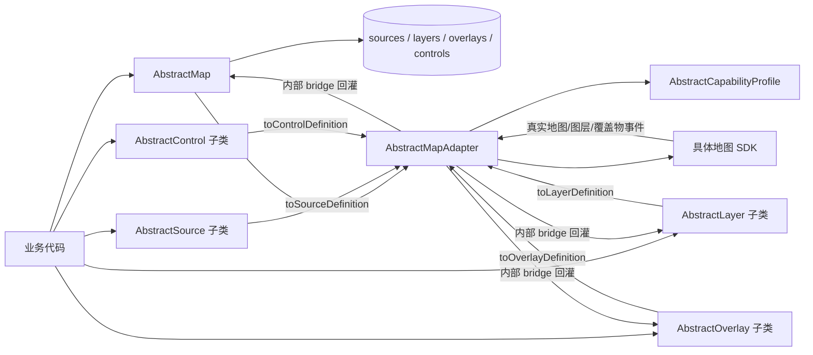
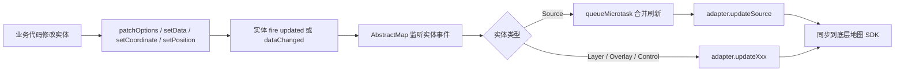
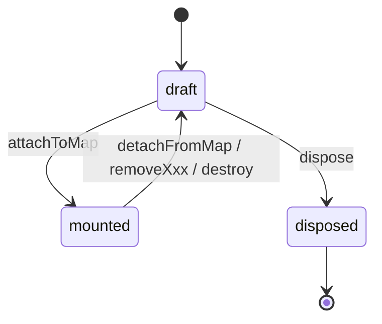
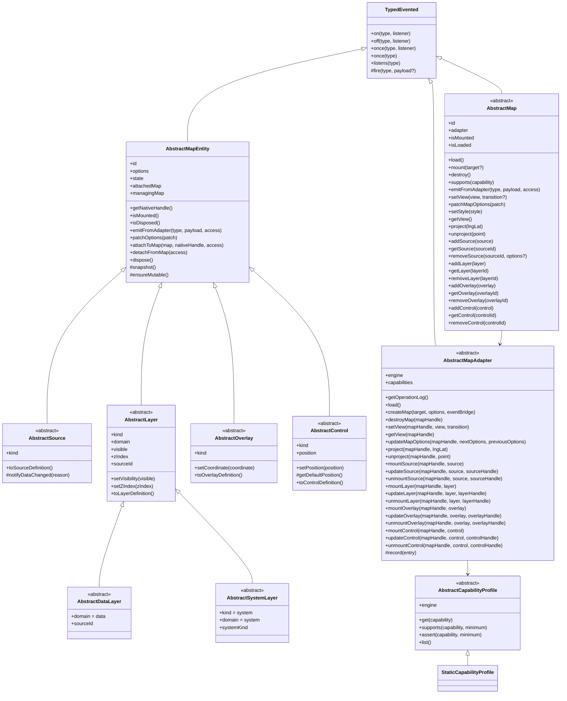
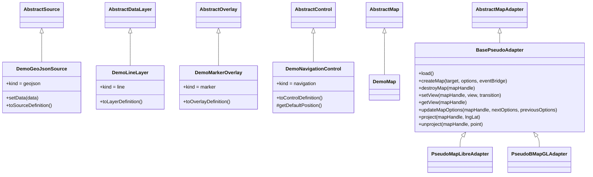

# Unified Map 标准 API 设计与接入指南

本文档面向两类读者：

- 使用者：想直接调用这套标准 API 来创建地图、数据源、图层、覆盖物和控件。
- 适配器实现者：想把这套统一抽象层落到某个具体地图框架上，例如 MapLibre、BMapGL、高德地图等。

这份项目当前是一个“核心抽象层 + 演示实现”：

- `core/` 目录定义统一类型系统、事件系统、生命周期、能力模型与地图调度中心。
- `pseudo/` 目录提供 `Demo*` 业务对象和 `Pseudo*Adapter`，用于演示 MapLibre 与 BMapGL 的接入方式。
- `main.ts` 可以消费这些演示结果，但真实 SDK 对接应写在新的 adapter 实现里，而不是直接复用伪适配器。

## 1. 项目要解决的问题

这套 API 的核心目标是：让业务代码依赖统一地图模型，而不是直接依赖某个地图 SDK。

换句话说，业务层只关心这些概念：

- 地图 `Map`
- 数据源 `Source`
- 图层 `Layer`
- 覆盖物 `Overlay`
- 控件 `Control`
- 适配器 `Adapter`
- 能力声明 `Capability Profile`

具体 SDK 差异，比如：

- MapLibre 有一等公民的 `source` / `layer` / `style` 概念。
- BMapGL 更偏平台型地图，很多数据层能力需要转译成 overlay 组。
- 有些引擎原生支持 `pitch`、`bearing`、`project/unproject`，有些只能模拟，甚至完全不支持。
- 地图、图层、覆盖物的交互事件在不同引擎里的来源完全不同，有的是原生事件，有的必须做 DOM 或命中测试桥接。

这些差异都被压到 `Adapter` 和 `Capability Profile` 层，而不是泄漏到业务代码里。

当前这版 `core/` 相比早期骨架已经发生了几个关键变化：

- `Map` 现在显式区分 `load()` 和 `mount()`，适配器可以先异步预加载，再创建底层地图实例。
- `Map` 统一托管 `source / layer / overlay / control` 注册表，并在挂载后负责实体的 materialize / dematerialize。
- 实体生命周期被 `internal-lifecycle.ts` 锁死，业务对象不能绕过 `Map` 自己挂载或卸载。
- 地图和实体的交互事件只能由 adapter 通过内部 bridge 回灌，不能由业务层伪造。
- `Source` 更新会被 `Map` 用 `queueMicrotask()` 合并，避免 `updated` 和 `dataChanged` 双触发时重复刷新底层 SDK。

## 2. 目录结构

```text
src/
  main.ts
  unified-map/
    index.ts
    core/
      adapter.ts
      capability.ts
      control.ts
      entity.ts
      events.ts
      internal-events.ts
      internal-lifecycle.ts
      layer.ts
      map.ts
      overlay.ts
      source.ts
      types.ts
    pseudo/
      demo.ts
      demo-models.ts
      pseudo-adapters.ts
```

模块职责如下：

| 路径 | 作用 |
| --- | --- |
| `core/types.ts` | 通用类型、统一定义对象、相机与坐标类型 |
| `core/events.ts` | 强类型事件系统、事件负载与生命周期事件定义 |
| `core/entity.ts` | 地图实体生命周期基类，统一 `options/state/nativeHandle` 管理 |
| `core/source.ts` | `Source` 抽象层，补充 `dataChanged` 语义事件 |
| `core/layer.ts` | `Layer` 抽象层，拆分数据图层与系统图层 |
| `core/overlay.ts` | `Overlay` 抽象层，统一位置与定义导出 |
| `core/control.ts` | `Control` 抽象层，统一控件槽位与定义导出 |
| `core/capability.ts` | 地图能力声明、查询与断言 |
| `core/adapter.ts` | 适配器抽象骨架，规定地图与所有实体的挂载更新接口 |
| `core/map.ts` | 统一 Map 调度中心，负责注册表、订阅、挂载、卸载与更新转发 |
| `core/internal-events.ts` | adapter 到 map/layer/overlay 的内部事件桥，仅供内部和 adapter 实现使用 |
| `core/internal-lifecycle.ts` | 实体托管关系与生命周期访问控制，仅供 `Map` 内部使用 |
| `pseudo/demo-models.ts` | 演示用 `Source / Layer / Overlay / Control / Map` |
| `pseudo/pseudo-adapters.ts` | 演示用 MapLibre / BMapGL 伪适配器 |
| `pseudo/demo.ts` | 演示场景构建、运行与日志格式化 |
| `index.ts` | 对外导出 `core` 与 `pseudo` 的公共符号 |

## 3. 标准 API 的核心思想

这一套设计可以概括为一句话：

> 业务对象负责描述自己，`Map` 负责托管生命周期和刷新调度，`Adapter` 负责把统一描述翻译成具体地图 SDK 调用，并把真实交互事件回灌回来。

### 3.1 整体关系图



这里有三个角色边界需要特别记住：

- 业务代码负责创建对象、修改对象状态、订阅统一事件。
- `AbstractMap` 负责注册、挂载、卸载、更新转发和实体托管约束。
- `AbstractMapAdapter` 负责 SDK 调用、句柄保存、事件桥接和能力声明。

### 3.2 更新传播链路



相机更新链路和实体更新链路是分开的：


`setView()` 只负责“提出相机变更请求”，而不是直接宣布视角已经变化。`viewChanged` 必须由 adapter 在观察到底层地图真实变化后再发出。

### 3.3 生命周期状态图



实体生命周期仍然只有三态：

- `draft`：已创建，但还未挂载到底层地图。
- `mounted`：已由 `Map` 挂载，持有底层 `nativeHandle`。
- `disposed`：对象彻底废弃，不可再修改、不可再复用。

地图本身没有单独的枚举状态，但有两个运行时标志：

- `isLoaded`：adapter 资源是否已经完成预加载。
- `isMounted`：底层地图实例是否已经创建。

因此地图的典型顺序是：

1. `new Map(...)`
2. `addSource / addLayer / addOverlay / addControl`
3. `await map.load()`
4. `map.mount()`
5. `map.destroy()` 或反复 `mount()` / `destroy()`

要点：

- 被 `Map` 托管的实体不能直接 `dispose()`。
- 已 `mounted` 的实体只能由 `Map` 通过内部访问令牌卸载。
- `destroy()` 只销毁底层地图实例，不会清空 `Map` 的注册表；后续可以再次 `mount()`。

## 4. 关键类型系统

在理解类之前，先理解这些核心类型：

| 类型 | 作用 |
| --- | --- |
| `LngLatLike` | 坐标输入，允许 `[lng, lat]` 或 `{ lng, lat }` |
| `LngLatLiteral` | 标准化后的经纬度字面量 |
| `ScreenPoint` | 屏幕坐标，包含 `x` 和 `y` |
| `CameraState` | 地图视角，包含 `center`、`zoom`、`bearing`、`pitch`、`bounds`、`padding` |
| `CameraTransition` | 相机动画配置，包含 `animate`、`durationMs`、`easing` |
| `MapMountTarget` | 挂载目标，目前只要求 `{ container }` |
| `UnifiedMapOptions` | 创建地图的统一入参，包含 `id`、`target`、`initialView`、`style`、`interactive` |
| `UnifiedMapRuntimeOptions` | 运行时可变的地图选项，目前是 `style` 和 `interactive` |
| `SourceDefinition` | `Source` 转成统一描述对象后的形态 |
| `DataLayerDefinition` | 数据图层定义，适合 MapLibre 这类 style layer 引擎 |
| `SystemLayerDefinition` | 系统图层定义，适合路况、卫星、底图、标签等平台能力 |
| `OverlayDefinition` | 覆盖物统一定义 |
| `ControlDefinition` | 控件统一定义 |
| `LifecycleState` | 实体生命周期状态：`draft` / `mounted` / `disposed` |
| `CapabilityDescriptor` | 能力声明，包含 `level`、`summary`、可选 `fallback` |
| `MapCapability` | 统一能力枚举，例如 `camera.pitch`、`cluster.geojson`、`query.features` |

当前类型系统有三个关键设计：

- “业务对象实例”负责承载状态和行为。
- “Definition 对象”负责把状态导出成统一、可翻译的结构。
- “CapabilityDescriptor” 负责声明这套结构在某个引擎里是 `native`、`emulated` 还是 `none`。

还需要特别注意 `engineExtensions` 扩展位：

- `SourceDefinition.engineExtensions?.maplibre.source`
- `DataLayerDefinition.engineExtensions?.maplibre.layer`

这两个字段不是统一抽象的必需字段，而是为 MapLibre 这类 style-spec 引擎提供的扩展优化位。core 不再直接依赖 MapLibre 类型，具体的引擎结构下沉到 adapter / demo 侧。其他 adapter 可以忽略，也可以定义自己的扩展字段。

## 5. 类结构图

### 5.1 核心抽象层



### 5.2 演示实现层



这层代码不是“真正的 SDK 封装”，它的作用是：

- 给使用者提供最小可运行样例。
- 给 adapter 实现者提供实现轮廓。
- 通过 `operationLog` 清楚展示不同地图引擎的落地差异。

## 6. 所有类实现总览

### 6.1 汇总表

| 类 / 符号 | 位置 | 角色 | 当前关键行为 |
| --- | --- | --- | --- |
| `TypedEvented<TEvents>` | `core/events.ts` | 强类型事件基类 | 支持 `on/off/once/listens`，`once(type)` 还支持 Promise 形式 |
| `AbstractMapEntity<TOptions, TExtraEvents>` | `core/entity.ts` | 所有地图实体的生命周期基类 | 维护 `options/state/nativeHandle`，限制挂载和卸载访问权限 |
| `AbstractSource<TOptions>` | `core/source.ts` | 数据源抽象层 | 提供 `toSourceDefinition()` 与 `dataChanged` 通知 |
| `AbstractLayer<TOptions, TDefinition>` | `core/layer.ts` | 图层抽象层 | 提供 `visible/zIndex` 状态与统一定义导出 |
| `AbstractDataLayer<TPaint, TOptions>` | `core/layer.ts` | 数据图层基类 | 固定 `domain = data`，从 `options.sourceId` 读取 source 依赖 |
| `AbstractSystemLayer<TSystemKind, TOptions>` | `core/layer.ts` | 系统图层基类 | 固定 `kind = system`、`domain = system`，并显式声明 `systemKind` |
| `AbstractOverlay<TOptions>` | `core/overlay.ts` | 覆盖物抽象层 | 统一位置更新与定义导出 |
| `AbstractControl<TOptions>` | `core/control.ts` | 控件抽象层 | 统一控件槽位更新与定义导出 |
| `AbstractCapabilityProfile<TCapability>` | `core/capability.ts` | 能力声明基类 | 支持 `get / supports / assert / list` |
| `StaticCapabilityProfile` | `core/capability.ts` | 静态能力表实现 | 用字典快速声明引擎能力 |
| `AbstractMapAdapter` | `core/adapter.ts` | 适配器基类 | 规定地图与实体的完整挂载更新接口 |
| `AbstractMap` | `core/map.ts` | 统一地图调度中心 | 持有注册表、订阅、materialize / dematerialize 逻辑 |
| `DemoGeoJsonSource` | `pseudo/demo-models.ts` | 演示 GeoJSON 数据源 | `setData()` 触发 `dataChanged` |
| `DemoLineLayer` | `pseudo/demo-models.ts` | 演示线图层 | 输出 `engineExtensions.maplibre.layer` 兼容结构 |
| `DemoMarkerOverlay` | `pseudo/demo-models.ts` | 演示 Marker 覆盖物 | 统一导出 marker 定义 |
| `DemoNavigationControl` | `pseudo/demo-models.ts` | 演示导航控件 | 默认停靠在 `top-right` |
| `DemoMap` | `pseudo/demo-models.ts` | 演示地图类 | 仅继承 `AbstractMap`，不额外加逻辑 |
| `BasePseudoAdapter` | `pseudo/pseudo-adapters.ts` | 伪适配器公共实现 | 提供 runtime、日志、相机与投影的基础行为 |
| `PseudoMapLibreAdapter` | `pseudo/pseudo-adapters.ts` | MapLibre 伪适配器 | 直接映射 source / layer / control 等一等公民能力 |
| `PseudoBMapGLAdapter` | `pseudo/pseudo-adapters.ts` | BMapGL 伪适配器 | 通过逻辑 source、overlay group、系统层转译模拟统一模型 |

### 6.2 `TypedEvented<TEvents>`

`TypedEvented` 是整个事件系统的基础。

它提供的能力很克制：

- `on(type, listener)`：注册持久监听器，返回可 `unsubscribe()` 的订阅对象。
- `off(type, listener)`：显式取消监听。
- `once(type, listener)`：注册一次性监听器。
- `once(type)`：返回 `Promise<EventOf<...>>`，适合 `await`。
- `listens(type)`：判断当前是否有人监听某个事件。

当前实现的几个特点：

- 事件对象统一长成 `{ type, target, ...payload }`。
- `payload` 为 `undefined` 时，会退化成空对象，不会额外塞 `payload` 字段。
- 没有通配符事件，也没有事件冒泡，模型非常直接。

### 6.3 `AbstractMapEntity<TOptions, TExtraEvents>`

`AbstractMapEntity` 是 `Source / Layer / Overlay / Control` 的共同基类。

它维护五个核心状态：

- `id`
- `optionsValue`
- `stateValue`
- `mapRef`
- `nativeHandle`

当前行为重点如下：

- `patchOptions(patch)` 会做浅合并，并立即触发 `updated` 事件。
- `attachToMap()` 与 `detachFromMap()` 必须拿到内部 `EntityLifecycleAccess` 才能调用。
- `attachToMap()` 要求该实体已经先被当前 `Map` 注册为 `managingMap`。
- `dispose()` 前必须确保实体已经从 `Map` 里移除；只要还被托管，就会报错。
- `emitFromAdapter()` 只能接受 adapter bridge 发来的访问令牌，业务层不能伪造交互事件。

这意味着：

- 实体不能自己“偷偷挂上地图”。
- 实体也不能在还挂着或还被托管的时候自杀式 `dispose()`。
- `getNativeHandle()` 是一个公开读取口，但不应该成为业务层依赖的主路径。

### 6.4 `AbstractSource<TOptions>`

`AbstractSource` 在 `AbstractMapEntity` 之上只增加了两件事：

- `kind`
- `toSourceDefinition()`

以及一个给子类用的保护方法：

- `notifyDataChanged(reason)`

为什么 `Source` 要单独有 `dataChanged`？

- 因为有些 source 更新并不是简单的 options patch，而是“底层数据内容真的变了”。
- `patchOptions()` 只表达“配置变了”。
- `dataChanged` 额外表达“数据语义变了”，方便 adapter 做更细粒度的刷新策略。

在当前 `Map` 实现里，`Source` 会同时订阅：

- `updated`
- `dataChanged`

但真正调用 `adapter.updateSource()` 之前会被微任务合并，所以像 `DemoGeoJsonSource.setData()` 这种先 `patchOptions()` 再 `notifyDataChanged()` 的写法，最终只会刷新一次底层 source。

### 6.5 `AbstractLayer<TOptions, TDefinition>`

`AbstractLayer` 是图层体系的公共基类。

当前统一约束是：

- 每个图层必须声明 `kind`。
- 每个图层必须声明 `domain`，取值是 `data` 或 `system`。
- 每个图层都支持 `visible`、`zIndex`、`metadata`。
- 每个图层都必须实现 `toLayerDefinition()`。

当前几个重要 getter / setter：

- `visible`：默认 `true`
- `zIndex`：默认 `undefined`
- `sourceId`：基类默认 `undefined`
- `setVisibility(visible)`：会触发 `updated` 和 `visibilityChanged`
- `setZIndex(zIndex)`：会触发 `updated` 和 `zIndexChanged`

这里要注意：

- `Map` 只订阅 `updated` 来触发 `adapter.updateLayer()`。
- `visibilityChanged` 和 `zIndexChanged` 是给业务订阅的语义事件，不负责驱动刷新。

### 6.6 `AbstractDataLayer<TPaint, TOptions>`

`AbstractDataLayer` 是面向 style-spec 式数据图层的基类。

它做了三件固定化：

- `domain` 固定为 `data`
- `kind` 只能来自 `DataLayerKind`
- `sourceId` 直接来自 `options.sourceId`

适合承载这些概念：

- `fill`
- `line`
- `symbol`
- `circle`
- `heatmap`
- `raster`

这类图层通常最适合 MapLibre、Mapbox GL 一类引擎，因为它们有原生的 source / layer 分离模型。

### 6.7 `AbstractSystemLayer<TSystemKind, TOptions>`

`AbstractSystemLayer` 是面向平台型系统图层的基类。

它把下面两个属性固定死：

- `kind = "system"`
- `domain = "system"`

同时通过类上的只读 `systemKind` 暴露系统图层语义，并在 `toLayerDefinition()` 时写入 definition 顶层，例如：

- `basemap`
- `traffic`
- `labels`
- `satellite`
- `roadnet`
- `terrain`

这类图层不一定依赖业务 source，更多时候是 adapter 直接调用底层平台能力开关。

### 6.8 `AbstractOverlay<TOptions>`

`AbstractOverlay` 用于承载 Marker、Popup、Polyline、Polygon 或自定义 overlay。

统一选项包括：

- `coordinate`
- `coordinates`
- `visible`
- `zIndex`
- `metadata`

当前基类只内置了一个通用操作：

- `setCoordinate(coordinate)`

它会：

- 浅合并 `options.coordinate`
- 触发 `updated`
- 再触发 `positionChanged`

如果某个 overlay 需要维护多点几何、HTML 内容或复杂样式，建议在子类里继续暴露自己的领域方法，再由 `toOverlayDefinition()` 统一导出。

### 6.9 `AbstractControl<TOptions>`

`AbstractControl` 负责统一控件槽位模型。

统一选项包括：

- `position`
- `visible`
- `metadata`

当前基类提供：

- `position` getter：若没显式配置，则回退到 `getDefaultPosition()`
- `setPosition(position)`：触发 `updated` 和 `positionChanged`
- `getDefaultPosition()`：默认返回 `top-right`
- `toControlDefinition()`：由子类实现

这使得不同 SDK 的控件锚点映射都可以收敛到同一组 `ControlSlot`。

### 6.10 `AbstractCapabilityProfile<TCapability>`

`Capability Profile` 是这套设计里非常关键的一层。

它解决的问题不是“这个 SDK 能不能做”，而是：

- 是原生做，还是模拟做？
- 模拟做的成本和限制是什么？
- 当能力不满足最低要求时，错误信息和降级方案是什么？

当前基类提供四个核心方法：

- `get(capability)`：返回单项能力描述
- `supports(capability, minimum = "emulated")`
- `assert(capability, minimum = "emulated")`
- `list()`：列出整个能力表

`supports()` 的默认最低级别是 `emulated`，这很重要。因为很多业务判断的真实问题是：

- “能不能做”

而不是：

- “是不是完全原生”

### 6.11 `StaticCapabilityProfile`

`StaticCapabilityProfile` 是 `AbstractCapabilityProfile` 的最直接实现。

它只做两件事：

- 保存 `engine`
- 保存 `capabilityTable`

适用场景：

- 某个 adapter 的能力边界基本是静态的。
- 你希望在 adapter 构造时一次性把能力表声明清楚。

当前 `PseudoMapLibreAdapter` 和 `PseudoBMapGLAdapter` 都是这样实现的。

### 6.12 `AbstractMapAdapter`

`AbstractMapAdapter` 规定了 adapter 的完整职责面。

它当前有两层角色：

- 作为抽象接口：规定所有必须实现的方法。
- 作为轻量基类：维护 `operationLog` 并提供 `record()`。

当前最重要的约束如下：

- `load()` 可以是空实现，也可以做异步资源预加载。
- `createMap(target, options, eventBridge)` 必须完成底层地图实例的完整初始化。
- `createMap()` 必须负责应用 `options.initialView` 和初始运行时配置。
- `createMap()` 只能使用 `target.container` 作为容器真值来源，不能再自己读 `options.target`。
- `setView()` 只负责请求相机变更，`viewChanged` 事件必须在 adapter 观察到底层地图真实变化后发出。
- `updateMapOptions()` 负责处理 `style` 和 `interactive` 等运行时变更。
- `project()` 和 `unproject()` 是统一空间转换能力的强制接口。
- 每种实体都必须有 `mount / update / unmount` 三段式接口。

当前设计里，每个实体 mount 后都会拿到自己的 `nativeHandle`：

- `sourceHandle`
- `layerHandle`
- `overlayHandle`
- `controlHandle`

这样 adapter 可以自由决定每个句柄到底保存什么：

- 原生 SDK 对象
- ID
- 批处理上下文
- overlay group 容器
- 逻辑注册记录

### 6.13 `AbstractMap`

`AbstractMap` 是整个系统真正的调度中心。

它当前承担的职责比早期版本明确得多：

- 管理 `sources / layers / overlays / controls` 四类注册表
- 管理每个实体的订阅
- 调用 adapter 完成 materialize / dematerialize
- 协调 `load()`、`mount()`、`destroy()`
- 统一转发地图运行时 API，例如 `setView()`、`project()`、`patchMapOptions()`

当前实现细节需要重点记住：

- `load()` 会缓存 `Promise`，并在失败时清空缓存，便于重试。
- `mount()` 前必须先 `await load()`。
- `mount()` 成功后，会按照 `source -> layer -> overlay -> control` 顺序 materialize 已注册实体。
- `destroy()` 会按照 `control -> overlay -> layer -> source` 的逆序卸载实体。
- `destroy()` 不会清空注册表，后续再次 `mount()` 会重新 materialize 这些实体。
- `patchMapOptions()` 即使在未挂载时也会更新内存态，等下次 `mount()` 时一起进入 `createMap()`。
- `getView()` 在未挂载时返回的是 `initialView`，不是某个缓存过的“最后视角”。

实体管理上的关键规则：

- `addSource()` / `addLayer()` / `addOverlay()` / `addControl()` 会先做唯一性校验，再绑定托管关系。
- 同一个实体不能同时被两个 `Map` 管理。
- `addLayer()` 如果引用了不存在的 `sourceId`，会立即报错。
- `removeSource()` 默认不允许带着依赖图层删除；若传 `{ cascade: true }`，会先删依赖 layer，再删 source。

刷新策略上的关键差异：

- `Source`：监听 `updated` 和 `dataChanged`，并用微任务合并刷新。
- `Layer / Overlay / Control`：只监听 `updated`，立即调用对应 `adapter.updateXxx()`。

### 6.14 `DemoGeoJsonSource`

这是一个演示用 GeoJSON source。

当前能力包括：

- `kind = "geojson"`
- `setData(data)`：先 `patchOptions({ data })`，再 `notifyDataChanged("replace-data")`
- `toSourceDefinition()`：输出统一 source 定义，并附带 `engineExtensions.maplibre.source`

这个类很好地展示了当前 `Source` 子类的推荐写法：

- 所有业务状态放在 `options`
- 领域方法只负责修改 `options`
- 真正导出给 adapter 的形态由 `toSourceDefinition()` 统一完成

### 6.15 `DemoLineLayer`

这是一个演示用线图层。

它的特点是：

- 继承自 `AbstractDataLayer`
- `kind = "line"`
- `options.sourceId` 为必填
- `toLayerDefinition()` 同时输出统一字段和 `engineExtensions.maplibre.layer`

它代表的就是最典型的 MapLibre 风格数据图层：

- 有 source
- 有 paint
- 有 layout
- 有 filter
- 可以带 `beforeId`

### 6.16 `DemoMarkerOverlay`

这是一个演示用 marker overlay。

它的特点是：

- `kind = "marker"`
- 强制要求 `coordinate`
- 额外携带 `color` 和可选 `label`

它表明 overlay 体系并不要求所有能力都抽象成统一字段。统一层只关心公共部分：

- 几何位置
- 显隐
- 层级
- metadata

其余领域字段留给具体 overlay 子类自己定义。

### 6.17 `DemoNavigationControl`

这是一个演示用导航控件。

它的特点是：

- `kind = "navigation"`
- 额外配置 `compass` 和 `showZoom`
- 默认位置来自 `getDefaultPosition()`，即 `top-right`

这个类展示了控件的推荐建模方式：

- 统一位置模型由基类托管
- 控件差异化配置由 options 自己扩展

### 6.18 `DemoMap`

`DemoMap` 本身没有额外逻辑，只是把 `AbstractMap` 具体化，便于在 demo 里直接实例化。

这也说明：

- 统一 `Map` 行为几乎都已经在 `AbstractMap` 里收敛完成
- 具体项目里如果没有额外业务语义，子类甚至可以保持空壳

### 6.19 `BasePseudoAdapter`

`BasePseudoAdapter` 不是抽象接口演示，而是一套最小的伪运行时实现。

它当前做了这些事情：

- 提供统一的 `capabilityTable()` 默认表
- 用 `PseudoNativeMap` 结构保存 `engine / mapId / container / view / style / interactive / eventBridge`
- 在 `load()`、`createMap()`、`destroyMap()`、`setView()`、`updateMapOptions()` 里记录日志
- 用简单线性换算实现 `project()` / `unproject()`

这里最值得注意的是 `setView()` 的实现方式：

- 先更新伪 runtime 的 `view`
- 再记录操作日志
- 再通过 `eventBridge.emit("viewChanged", ...)` 发出地图视角变化事件

虽然这是伪实现，但它准确体现了当前 adapter 契约：`viewChanged` 必须从 adapter 回灌，而不是由 `Map.setView()` 自己 fire。

### 6.20 `PseudoMapLibreAdapter`

这个类用来展示 MapLibre 风格引擎为什么更贴近这套统一模型。

当前映射方式非常直接：

- `mountSource()` 对应 `map.addSource()`
- `mountLayer()` 对应 `map.addLayer()`
- `unmountLayer()` 对应 `map.removeLayer()`
- `mountControl()` 对应 `map.addControl()`
- overlay 通过 Marker / Popup bridge 表达

能力声明上，它把大多数能力都标成了 `native`，只有少数项例外：

- `events.keyboard` 是 `emulated`
- `terrain` 是 `emulated`

这很符合现实：MapLibre 对数据图层、style、投影、图层管理非常友好，真正麻烦的往往是浏览器容器层面的键盘和部分插件能力。

### 6.21 `PseudoBMapGLAdapter`

这个类用来展示平台型地图 SDK 接入统一模型时会遇到的典型问题。

当前策略包括：

- `Source` 只做逻辑注册，不对应底层一等公民对象
- 数据图层通常翻译成 overlay group
- 系统图层走 `systemKind` 分支单独 materialize
- 交互和查询能力很多需要模拟

能力声明上，它明确区分了：

- `native`：例如 `camera.bearing`、`camera.pitch`、`events.map-mouse`、`events.overlay-mouse`
- `emulated`：例如 `style.swap`、`source.management`、`layer.management`、`events.layer-touch`
- `none`：例如 `query.features`、`terrain`

这正是 `Capability Profile` 要表达的真实信息：不是简单的“支持 / 不支持”，而是“支持到什么程度、靠什么方式支持、退路是什么”。

## 7. 标准 API 使用手册

### 7.1 使用步骤

推荐按下面顺序使用：

1. 创建 adapter。
2. 创建具体 `Map` 子类实例。
3. 创建 `Source / Layer / Overlay / Control` 子类实例。
4. 通过 `map.addXxx()` 注册这些实体。
5. 订阅你关心的地图事件和实体事件。
6. `await map.load()`。
7. `map.mount()`。
8. 运行中通过对象方法更新状态；退出时根据需要 `removeXxx()`、`dispose()` 或 `map.destroy()`。

最容易踩坑的顺序错误是：

- 还没 `load()` 就 `mount()`
- `Layer` 先于它依赖的 `Source` 注册
- 实体还被 `Map` 托管时就直接 `dispose()`

### 7.2 最小可运行示例

下面的示例完全符合当前代码结构：

```ts
import {
  DemoGeoJsonSource,
  DemoLineLayer,
  DemoMap,
  DemoMarkerOverlay,
  DemoNavigationControl,
  PseudoMapLibreAdapter,
  type DemoFeatureCollection,
} from "../src/unified-map";

function createRouteData(): DemoFeatureCollection {
  return {
    type: "FeatureCollection",
    features: [
      {
        type: "Feature",
        geometry: {
          type: "LineString",
          coordinates: [
            [116.391, 39.907],
            [116.404, 39.915],
            [116.423, 39.927],
          ],
        },
        properties: {
          name: "demo-route",
        },
      },
    ],
  };
}

async function boot() {
  const adapter = new PseudoMapLibreAdapter();
  const map = new DemoMap(
    {
      id: "demo-map",
      target: "#map",
      style: "https://demotiles.maplibre.org/style.json",
      interactive: true,
      initialView: {
        center: [116.404, 39.915],
        zoom: 11,
        bearing: 15,
        pitch: 35,
      },
    },
    adapter,
  );

  const source = map.addSource(
    new DemoGeoJsonSource("route-source", {
      data: createRouteData(),
      cluster: false,
      tolerance: 0.2,
    }),
  );

  const layer = map.addLayer(
    new DemoLineLayer("route-line", {
      sourceId: "route-source",
      paint: {
        "line-color": "#0b57d0",
        "line-width": 4,
      },
      metadata: {
        semanticRole: "route",
      },
    }),
  );

  const overlay = map.addOverlay(
    new DemoMarkerOverlay("arrival-marker", {
      coordinate: [116.423, 39.927],
      color: "#d93025",
      label: "Arrival",
      zIndex: 3,
      visible: true,
    }),
  );

  map.addControl(
    new DemoNavigationControl("nav", {
      position: "top-right",
      compass: true,
      showZoom: true,
    }),
  );

  map.on("mounted", (event) => {
    console.log("mounted:", event.mapId, event.engine);
  });

  map.on("viewChanged", (event) => {
    console.log("view changed:", event.view.zoom, event.reason);
  });

  source.on("dataChanged", (event) => {
    console.log("source updated:", event.id, event.reason);
  });

  layer.on("visibilityChanged", (event) => {
    console.log("layer visible:", event.id, event.visible);
  });

  await map.load();
  map.mount();

  source.setData(createRouteData());
  overlay.setCoordinate([116.426, 39.929]);
  map.setView({
    center: [116.41, 39.92],
    zoom: 12,
    bearing: 30,
    pitch: 45,
  });
}
```

这个最小示例已经覆盖了当前 API 的关键使用方式：

- 先注册，再 `load()` / `mount()`
- 通过实体方法修改状态
- 通过统一事件接口监听变化
- 相机变化依赖 adapter 回灌 `viewChanged`

### 7.3 动态更新的标准写法

当前推荐的更新方式是“改对象，不碰 adapter”。

```ts
source.setData(nextData);

layer.setVisibility(false);
layer.setZIndex(10);
layer.patchOptions({
  paint: {
    "line-color": "#d93025",
    "line-width": 6,
  },
});

overlay.setCoordinate([116.45, 39.93]);
overlay.patchOptions({
  visible: false,
});

control.setPosition("bottom-right");

map.patchMapOptions({
  interactive: false,
});

map.setStyle("https://example.com/next-style.json");

map.setView(
  {
    center: [116.39, 39.90],
    zoom: 10,
  },
  {
    animate: true,
    durationMs: 800,
    easing: "fly",
  },
);
```

这些调用背后分别会走到：

- `source` 更新：`adapter.updateSource()`
- `layer` 更新：`adapter.updateLayer()`
- `overlay` 更新：`adapter.updateOverlay()`
- `control` 更新：`adapter.updateControl()`
- 地图运行时更新：`adapter.updateMapOptions()`
- 相机更新：`adapter.setView()`

推荐约束：

- 不要在业务层直接调用 adapter 的 `updateXxx()`。
- 不要直接篡改 `entity.options`，必须通过领域方法或 `patchOptions()`。
- `Source` 子类如果存在“数据内容真的变了”的场景，记得调用 `notifyDataChanged()`。

### 7.4 强类型事件订阅

这一套事件系统的目的不是“语法糖”，而是让业务层订阅时就拿到准确负载。

```ts
const mounted = await map.once("mounted");
console.log(mounted.mapId, mounted.engine);

const subscription = map.on("keydown", (event) => {
  console.log(event.key, event.repeat, event.mapId);
});

layer.on("click", (event) => {
  console.log(event.id, event.features?.[0]?.properties);
});

overlay.on("dragend", (event) => {
  console.log(event.id, event.kind, event.lngLat);
});

subscription.unsubscribe();
```

当前事件来源要分清：

- `mounted`、`destroyed`、`sourceAdded` 这类生命周期事件由 `Map` 自己触发。
- `updated`、`dataChanged`、`positionChanged` 这类语义事件由实体自己触发。
- `viewChanged`、地图鼠标触摸键盘事件、图层点击事件、overlay 拖拽事件，必须由 adapter 通过 bridge 回灌。

如果你在实现 adapter，需要使用内部桥接工具：

- 地图事件：`createMapEventBridge(map)` 生成的 `eventBridge.emit(...)`
- 图层事件：`emitLayerEvent(layer, type, payload)`
- 覆盖物事件：`emitOverlayEvent(overlay, type, payload)`

### 7.5 能力判断的标准写法

统一能力判断应该基于 `Capability Profile`，而不是散落的 `if (engine === "...")`。

```ts
if (map.supports("camera.pitch")) {
  map.setView({
    center: [116.404, 39.915],
    zoom: 12,
    pitch: 45,
  });
}

adapter.capabilities.assert("style.swap");

const terrain = adapter.capabilities.get("terrain");
console.log(terrain.level, terrain.summary, terrain.fallback);

for (const [capability, descriptor] of adapter.capabilities.list()) {
  console.log(capability, descriptor.level);
}
```

当前推荐策略：

- 业务层用 `map.supports()` 做轻量判断。
- adapter 或框架接入层用 `assert()` 做硬性前置条件校验。
- 设计文档和评审里优先讨论 `native / emulated / none`，而不是只写“支持 / 不支持”。

具体能力矩阵可继续参考：

- `docs/maplibre-capability-matrix.md`
- `docs/bmapgl-capability-matrix.md`

### 7.6 投影与反投影

统一 API 直接在 `Map` 上暴露了投影和反投影：

```ts
const point = map.project([116.404, 39.915]);
console.log(point.x, point.y);

const lngLat = map.unproject({ x: 320, y: 180 });
console.log(lngLat.lng, lngLat.lat);
```

使用约束很简单：

- 地图未挂载时不能调用。
- adapter 必须保证返回统一格式。

### 7.7 销毁

当前设计里，“销毁地图”和“释放实体”是两件事。

```ts
map.destroy();

map.removeOverlay("arrival-marker");
overlay.dispose();

map.removeLayer("route-line");
map.removeSource("route-source");
layer.dispose();
source.dispose();
```

你需要区分三个动作：

- `map.destroy()`：只销毁底层地图实例，并把所有实体从 `mounted` 退回 `draft`
- `map.removeXxx()`：把实体从注册表和托管关系里移除
- `entity.dispose()`：彻底废弃实体对象

几个关键规则：

- 只要实体还被 `Map` 管理，就不能 `dispose()`。
- `removeSource()` 默认要求没有 layer 依赖；如需联动删除，使用 `{ cascade: true }`。
- `destroy()` 后，实体仍然在注册表里，所以可以再次 `mount()`。

## 8. 如何用这套 API 实现某个具体地图框架

### 8.1 第一步：先声明能力，而不是先写 if/else

接入新地图框架时，第一个产物不应该是“到处写分支”，而应该是能力表。

```ts
import {
  AbstractMapAdapter,
  StaticCapabilityProfile,
  type MapCapability,
} from "../src/unified-map";

const capabilityTable = {
  "camera.bearing": {
    level: "native",
    summary: "Heading can be controlled directly.",
  },
  "camera.pitch": {
    level: "emulated",
    summary: "Pitch can be simulated through camera presets.",
    fallback: "Drop pitch when the engine runs in 2D mode.",
  },
  "style.swap": {
    level: "none",
    summary: "Style swapping is not supported.",
    fallback: "Recreate the map instance when style changes.",
  },
  // ...其余能力
} satisfies Record<
  MapCapability,
  {
    level: "none" | "emulated" | "native";
    summary: string;
    fallback?: string;
  }
>;

class MyAdapter extends AbstractMapAdapter {
  public readonly engine = "my-engine";

  public constructor() {
    super(new StaticCapabilityProfile("my-engine", capabilityTable));
  }

  // ...实现后续抽象方法
}
```

为什么先做这一步：

- 你会更早暴露引擎真实边界。
- 文档、评审、测试都能围绕能力表展开。
- 后续业务代码可以立刻开始用 `supports/assert`，而不是等 adapter 完工后再回头补。

### 8.2 第二步：设计底层运行时句柄

在真正写 `createMap()` 之前，先确定你要保存哪些运行时对象。

推荐先画出三类句柄：

- 地图句柄：`mapHandle`
- 实体句柄：`sourceHandle / layerHandle / overlayHandle / controlHandle`
- 辅助上下文：命中测试器、容器引用、DOM bridge、逻辑注册表

例如：

```ts
interface MyNativeMapRuntime {
  map: SomeSdkMap;
  container: HTMLElement;
  eventBridge: MapEventBridge;
  sources: Map<string, unknown>;
  layers: Map<string, unknown>;
}
```

当前框架对句柄类型没有任何强约束，原因很现实：

- 有些 SDK 会返回原生对象。
- 有些 SDK 只能返回逻辑 registry 条目。
- 有些 layer 实际上对应的是一组 overlay，而不是一个对象。

所以不要把 `nativeHandle` 理解得过于狭义，它本质上是 adapter 自己的挂载回执。

### 8.3 第三步：实现地图生命周期与相机 API

地图级接口是 adapter 的第一优先级。

至少要正确实现下面这些方法：

- `load()`
- `createMap()`
- `destroyMap()`
- `setView()`
- `getView()`
- `updateMapOptions()`
- `project()`
- `unproject()`

这里有几条当前契约必须遵守：

- `createMap()` 必须负责应用 `initialView`，`AbstractMap.mount()` 不会额外补一次 `setView()`。
- `createMap()` 必须同时处理初始 `style` 和 `interactive`。
- `createMap()` 只能使用 `target.container`，不要再读 `options.target`。
- `setView()` 不能自己假设成功，必须在观察到底层地图真实变化后再通过 `eventBridge` 发 `viewChanged`。
- `updateMapOptions()` 应该做差量更新，至少能区分 `nextOptions` 和 `previousOptions`。

典型伪代码如下：

```ts
public override createMap(
  target: MapMountTarget,
  options: Readonly<UnifiedMapOptions>,
  eventBridge: MapEventBridge,
): unknown {
  const map = new SomeSdkMap({
    container: target.container,
    center: options.initialView.center,
    zoom: options.initialView.zoom,
    style: options.style,
    interactive: options.interactive,
  });

  map.on("moveend", () => {
    eventBridge.emit("viewChanged", {
      mapId: options.id,
      view: this.getView(map),
      reason: "interaction",
      inputType: "mouse",
    });
  });

  return map;
}
```

### 8.4 第四步：实现 Source 的逻辑注册

Source 接入的核心问题是：你的引擎到底有没有“source 一等公民”。

如果有，路径很直接：

- `mountSource()`：创建并注册 source
- `updateSource()`：增量更新 source 数据或配置
- `unmountSource()`：移除 source

如果没有，就要像 BMapGL 方案那样自己维护逻辑 source registry：

- `mountSource()`：只登记定义，不一定创建原生对象
- `updateSource()`：通知依赖 layer 或 overlay group 重算
- `unmountSource()`：清掉逻辑注册记录

当前 `Map` 对 Source 的刷新特性是：

- 订阅 `updated`
- 订阅 `dataChanged`
- 微任务合并刷新

这意味着 adapter 可以放心把 `updateSource()` 当成“source 最终态已稳定”的入口，而不需要自己再做一层去抖。

### 8.5 第五步：实现 Layer 到具体框架的翻译

Layer 接入时，首先要看 `definition.domain`：

- `data`：业务数据图层
- `system`：底图、路况、卫星之类的平台图层

对于 `data` 图层，adapter 通常要处理这些字段：

- `sourceId`
- `beforeId`
- `layout`
- `paint`
- `filter`
- `minzoom`
- `maxzoom`

对于 `system` 图层，adapter 通常要处理：

- `systemKind`
- `options`

当前统一模型的优势在于：

- MapLibre 可以直接吃 `DataLayerDefinition`
- BMapGL 可以把 `DataLayerDefinition` 翻译成 overlay group
- 系统图层不再被错误塞进 style layer 模型里

所以实现时不要把所有 layer 都试图硬塞成同一种底层对象。

### 8.6 第六步：实现 Overlay 和 Control

Overlay 和 Control 比 layer 更接近 SDK 的“对象式 API”。

实现时建议分别考虑：

- 如何创建原生对象
- 如何更新位置 / 显隐 / 层级 / 配置
- 如何清理原生对象

overlay 常见模式：

- marker / popup 直映射
- polyline / polygon 走几何对象
- 自定义 overlay 挂 DOM 或 canvas

control 常见模式：

- 统一槽位映射到底层 anchor
- 位置变化时做 remove + add 或原生 reposition

如果底层 SDK 的对象是不可变的，也没有问题，`updateOverlay()` / `updateControl()` 完全可以内部做“销毁后重建”。

### 8.7 第七步：不要让业务层直接碰 SDK

这条是整个统一层能否成立的分水岭。

应该坚持的原则是：

- 业务层只改统一对象，不改原生 SDK 对象。
- 业务层只订阅统一事件，不直接绑 SDK 事件。
- 业务层用 `map.supports()` 判断能力，不写引擎分支。

当前代码已经在几个层面防止越权：

- 生命周期访问令牌只掌握在 `Map` 内部。
- 交互事件访问令牌只掌握在内部 bridge。
- `Map` 统一托管实体，不允许一个实体跨多个地图实例复用。

`getNativeHandle()` 的存在并不意味着鼓励业务依赖底层句柄。它更适合作为：

- adapter 内部调试入口
- 高级诊断工具
- 框架接入测试辅助

### 8.8 MapLibre 为什么更好接

MapLibre 更贴近这套统一模型，原因不是“它更高级”，而是模型更相似：

- 有一等公民的 source
- 有一等公民的 data layer
- 有 style / filter / paint / layout 体系
- 有成熟的 `project()` / `unproject()`
- 有相对明确的相机模型

BMapGL 更难接，主要因为：

- source / layer 需要 adapter 自己造逻辑层
- 数据图层经常要翻译成 overlay group
- 一部分事件和查询能力只能模拟
- 系统图层和平台能力很多，但和统一 style layer 模型并不同构

这不是说 BMapGL 不能接，而是接入时更依赖：

- 逻辑 registry
- 命中测试桥接
- capability 降级声明

## 9. 接入新地图框架的推荐步骤

推荐按下面顺序落地：

1. 先写能力矩阵，明确 `native / emulated / none`。
2. 实现 `load()`、`createMap()`、`destroyMap()`、`getView()`、`setView()`。
3. 接通 `viewChanged` 事件桥。
4. 实现 `project()` / `unproject()`。
5. 实现 `Source` 三段式接口。
6. 实现 `Layer` 三段式接口，并先区分 `data` 与 `system`。
7. 实现 `Overlay` 与 `Control`。
8. 再补地图事件、图层事件、overlay 事件桥接。
9. 最后补 demo、能力矩阵文档和边界测试。

推荐的验证清单：

- `await map.load(); map.mount(); map.destroy(); map.mount();` 能否循环执行
- `source.setData()` 是否只触发一次底层刷新
- `removeSource()` 是否正确处理 layer 依赖和 `cascade`
- `viewChanged` 是否真的来自底层观察结果而不是伪造
- `dispose()` 是否只能在解除托管后调用

## 10. 这套 API 的设计价值

这套 API 当前真正的价值，不在于“把所有地图 SDK 抽象成一样”，而在于把变化和差异放到了可控的位置。

具体体现在：

- 业务代码只依赖统一模型，迁移引擎时改动面更小。
- 生命周期被 `Map` 明确托管，实体不会各自偷偷持有和污染底层地图实例。
- 事件模型是强类型的，地图事件、图层事件、覆盖物事件都能在订阅端拿到稳定结构。
- capability 模型把“能不能做、怎么做、退路是什么”都显式化了。
- `Source / Layer / Overlay / Control` 的三段式挂载接口让 adapter 的职责边界很清楚。

如果只用一句话总结当前这版 `core` 的方向，可以这样说：

> 这不是一个“图省事的统一封装”，而是一套把生命周期、事件、能力和 SDK 差异组织成稳定工程边界的地图抽象层。
